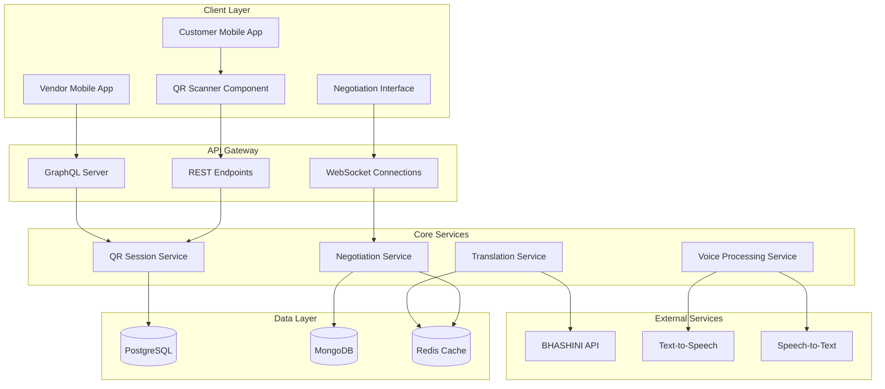

# Design Document: Cross-Language QR Commerce

## Overview

The Cross-Language QR Commerce feature enables seamless multilingual negotiations between vendors and customers through QR code-initiated sessions. The system leverages VyaparMitra's existing voice processing pipeline, BHASHINI translation services, and real-time GraphQL infrastructure to create a unified communication experience that transcends language barriers.

The feature integrates three core capabilities:
1. **QR Code Session Management**: Dynamic generation and scanning of session-specific QR codes
2. **Real-Time Multilingual Communication**: Bidirectional voice and text translation with live delivery
3. **Context-Aware Transaction Flow**: Seamless transition from negotiation to payment while preserving language preferences

## Architecture

### High-Level Architecture



### Service Architecture

The system follows a microservices-inspired architecture within the existing VyaparMitra monolith:

1. **QR Session Service**: Manages QR code generation, validation, and session lifecycle
2. **Translation Service**: Handles multilingual translation with fallback mechanisms
3. **Voice Processing Service**: Integrates with existing TTS/STT pipeline
4. **Negotiation Service**: Manages real-time communication and message persistence
5. **Payment Integration Service**: Bridges negotiation context to payment processing

## Components and Interfaces

### QR Session Service

**Purpose**: Manages the lifecycle of QR code-based negotiation sessions

**Key Methods**:
```typescript
interface QRSessionService {
  generateQRCode(vendorId: string, productId: string, vendorLanguage: string): Promise<QRCodeData>
  validateQRCode(qrToken: string): Promise<SessionValidation>
  createNegotiationRoom(sessionId: string, customerLanguage: string): Promise<NegotiationRoom>
  expireSession(sessionId: string): Promise<void>
  getActiveSession(sessionId: string): Promise<NegotiationSession | null>
}

interface QRCodeData {
  qrCodeUrl: string
  sessionToken: string
  expiresAt: Date
  sessionId: string
}

interface SessionValidation {
  isValid: boolean
  sessionId: string
  vendorId: string
  productId: string
  vendorLanguage: string
  expiresAt: Date
}
```

### Translation Service

**Purpose**: Provides multilingual translation with intelligent fallback handling

**Key Methods**:
```typescript
interface TranslationService {
  translateMessage(text: string, fromLang: string, toLang: string): Promise<TranslationResult>
  translateWithContext(text: string, context: ConversationContext): Promise<TranslationResult>
  getCachedTranslation(text: string, fromLang: string, toLang: string): Promise<string | null>
  validateLanguagePair(fromLang: string, toLang: string): boolean
}

interface TranslationResult {
  translatedText: string
  confidence: number
  originalText: string
  fromLanguage: string
  toLanguage: string
  translationProvider: 'BHASHINI' | 'FALLBACK' | 'CACHED'
}

interface ConversationContext {
  sessionId: string
  previousMessages: Message[]
  negotiationTopic: string
  productCategory: string
}
```

### Voice Processing Service

**Purpose**: Handles voice input/output with language-specific processing

**Key Methods**:
```typescript
interface VoiceProcessingService {
  speechToText(audioData: Buffer, language: string): Promise<STTResult>
  textToSpeech(text: string, language: string, voiceProfile?: string): Promise<TTSResult>
  detectLanguage(audioData: Buffer): Promise<LanguageDetection>
  validateAudioQuality(audioData: Buffer): Promise<AudioQualityCheck>
}

interface STTResult {
  text: string
  confidence: number
  language: string
  processingTime: number
}

interface TTSResult {
  audioData: Buffer
  duration: number
  language: string
  voiceProfile: string
}
```

### Negotiation Service

**Purpose**: Manages real-time communication and message flow

**Key Methods**:
```typescript
interface NegotiationService {
  sendMessage(sessionId: string, senderId: string, message: MessageInput): Promise<Message>
  subscribeToMessages(sessionId: string, userId: string): AsyncIterator<Message>
  getMessageHistory(sessionId: string, limit?: number): Promise<Message[]>
  updateTypingStatus(sessionId: string, userId: string, isTyping: boolean): Promise<void>
  markSessionComplete(sessionId: string, agreementDetails: AgreementDetails): Promise<void>
}

interface MessageInput {
  content: string
  type: 'TEXT' | 'VOICE'
  language: string
  audioData?: Buffer
}

interface Message {
  id: string
  sessionId: string
  senderId: string
  content: string
  translatedContent?: string
  type: 'TEXT' | 'VOICE'
  language: string
  targetLanguage?: string
  timestamp: Date
  audioUrl?: string
  translationStatus: 'PENDING' | 'COMPLETED' | 'FAILED'
}
```

## Data Models

### QR Session Model

```typescript
interface QRSession {
  id: string
  sessionToken: string
  vendorId: string
  productId: string
  vendorLanguage: string
  customerLanguage?: string
  status: 'ACTIVE' | 'JOINED' | 'COMPLETED' | 'EXPIRED'
  createdAt: Date
  expiresAt: Date
  lastActivityAt: Date
  qrCodeUrl: string
}
```

### Negotiation Room Model

```typescript
interface NegotiationRoom {
  id: string
  sessionId: string
  vendorId: string
  customerId?: string
  vendorLanguage: string
  customerLanguage?: string
  status: 'WAITING' | 'ACTIVE' | 'COMPLETED' | 'ABANDONED'
  messages: Message[]
  createdAt: Date
  lastMessageAt?: Date
  agreementReached: boolean
  agreementDetails?: AgreementDetails
}
```

### Translation Cache Model

```typescript
interface TranslationCache {
  id: string
  sourceText: string
  translatedText: string
  fromLanguage: string
  toLanguage: string
  provider: string
  confidence: number
  createdAt: Date
  usageCount: number
  lastUsedAt: Date
}
```

### Message Model

```typescript
interface Message {
  id: string
  sessionId: string
  senderId: string
  senderType: 'VENDOR' | 'CUSTOMER'
  content: string
  originalContent: string
  language: string
  targetLanguage: string
  type: 'TEXT' | 'VOICE'
  translationStatus: 'PENDING' | 'COMPLETED' | 'FAILED'
  audioUrl?: string
  audioData?: Buffer
  timestamp: Date
  deliveredAt?: Date
  readAt?: Date
}
```

Now I need to use the prework tool to analyze the acceptance criteria before writing the Correctness Properties section.

<function_calls>
<invoke name="prework">
<parameter name="featureName">cross-language-qr-commerce

## Correctness Properties

*A property is a characteristic or behavior that should hold true across all valid executions of a system—essentially, a formal statement about what the system should do. Properties serve as the bridge between human-readable specifications and machine-verifiable correctness guarantees.*

After analyzing the acceptance criteria and performing property reflection to eliminate redundancy, the following properties capture the essential correctness requirements:

### QR Code and Session Management Properties

**Property 1: QR Code Uniqueness and Structure**
*For any* vendor and product combination, generating a QR code should produce a unique session token and encode all required information (session token, product ID, vendor ID)
**Validates: Requirements 1.1, 1.4**

**Property 2: Session Creation Consistency**
*For any* QR code generation, a corresponding negotiation room should be created with the correct vendor language preferences and 24-hour expiration
**Validates: Requirements 1.2, 1.3**

**Property 3: Session Cleanup on Expiration**
*For any* expired QR session, the system should automatically clean up the associated negotiation room and prevent further access
**Validates: Requirements 1.5, 2.3**

### QR Code Scanning and Validation Properties

**Property 4: QR Code Validation and Decoding**
*For any* valid QR code, scanning should decode session information correctly and redirect to negotiation interface, while invalid QR codes should be rejected
**Validates: Requirements 2.1, 2.5**

**Property 5: Language Selection Interface**
*For any* session join, the system should prompt for language selection with exactly 12 supported language options
**Validates: Requirements 2.2**

**Property 6: Real-time Connection Establishment**
*For any* valid session join, a real-time connection to the negotiation room should be established
**Validates: Requirements 2.4**

### Translation and Communication Properties

**Property 7: Voice-to-Text Processing**
*For any* voice message in a supported language, the voice pipeline should convert speech to text in the sender's language
**Validates: Requirements 3.1**

**Property 8: Text Translation with Fallback**
*For any* text message, the translation engine should attempt BHASHINI translation first, then fallback services, and display original message with error indicator if all fail
**Validates: Requirements 3.2, 7.1, 7.2, 7.3**

**Property 9: Text-to-Speech Conversion**
*For any* translated text, the voice pipeline should convert it to speech in the recipient's language
**Validates: Requirements 3.3**

**Property 10: Message History Persistence**
*For any* message sent, both original and translated versions should be stored and maintained in message history
**Validates: Requirements 3.5**

**Property 11: Language Switching Updates**
*For any* participant language change mid-session, all future translations should use the new target language
**Validates: Requirements 3.6**

### Input Method and UI Properties

**Property 12: Dual Input Method Support**
*For any* negotiation session, both voice recording and text input controls should be available simultaneously
**Validates: Requirements 4.4**

**Property 13: Voice Input Feedback and Fallback**
*For any* voice input attempt, visual feedback should be displayed during processing, and text input should remain available if voice processing fails
**Validates: Requirements 4.2, 4.3**

**Property 14: Input Method Indication**
*For any* message sent, the input method used (voice or text) should be indicated to the recipient
**Validates: Requirements 4.5**

### Real-time Delivery and Performance Properties

**Property 15: Message Delivery Timing**
*For any* message sent, the original should be delivered to sender within 100ms and translated version to recipient within 2 seconds
**Validates: Requirements 5.1, 5.2**

**Property 16: Network Resilience**
*For any* network connectivity issues, messages should be queued and delivered when connection is restored
**Validates: Requirements 5.4**

**Property 17: Typing Indicators**
*For any* message composition activity, typing indicators should be displayed to other participants
**Validates: Requirements 5.5**

### Session Persistence and Recovery Properties

**Property 18: Immediate Message Persistence**
*For any* message or negotiation state change, data should be persisted to database immediately upon receipt
**Validates: Requirements 6.1**

**Property 19: Session Recovery on Reconnection**
*For any* participant reconnection after disconnection, complete message history should be restored
**Validates: Requirements 6.2**

**Property 20: Session Data Retention**
*For any* abandoned session (both participants leave), session data should remain available for exactly 7 days
**Validates: Requirements 6.3**

**Property 21: Session Rejoin Capability**
*For any* active session, participants should be able to rejoin using the same QR code multiple times
**Validates: Requirements 6.4**

### Transaction Flow Properties

**Property 22: Payment Transition with Context**
*For any* successful negotiation agreement, transition to payment should preserve both session context and language preferences
**Validates: Requirements 6.5, 8.1, 8.4**

**Property 23: Multilingual Payment Interface**
*For any* customer in payment flow, all payment information should be displayed in their selected language
**Validates: Requirements 8.2**

**Property 24: Multilingual Payment Confirmations**
*For any* successful payment, confirmation messages should be sent to both participants in their respective languages
**Validates: Requirements 8.3**

**Property 25: Payment Failure Recovery**
*For any* payment failure, participants should be able to return to negotiation with full context preserved
**Validates: Requirements 8.5**

### Translation Quality and Logging Properties

**Property 26: Translation Failure Logging**
*For any* translation failure, the system should log the failure for monitoring and improvement
**Validates: Requirements 7.4**

**Property 27: Context Preservation in Translation**
*For any* message translation within a session, context and intent should be preserved across the conversation
**Validates: Requirements 7.5**

**Property 28: Translation Caching**
*For any* frequently used translation, the system should cache and reuse it to improve response times
**Validates: Requirements 10.4**

### Security and Access Control Properties

**Property 29: Authentication Before Access**
*For any* negotiation session access attempt, participants should be authenticated before being allowed entry
**Validates: Requirements 9.2**

**Property 30: QR Code Access Control**
*For any* QR code scan, unauthorized access should be prevented through proper validation
**Validates: Requirements 9.3**

**Property 31: Automatic Session Expiration**
*For any* session with 24 hours of inactivity, the system should automatically expire the session
**Validates: Requirements 9.4**

**Property 32: Voice Data Cleanup**
*For any* voice message successfully converted to text, voice recordings should not be stored unless explicitly requested
**Validates: Requirements 9.5**

### Performance Properties

**Property 33: Voice Processing Performance**
*For any* voice input, speech-to-text conversion should complete within 3 seconds
**Validates: Requirements 10.2**

**Property 34: Translation Performance**
*For any* translation request, 95% should complete within 2 seconds
**Validates: Requirements 10.3**

**Property 35: Graceful Service Degradation**
*For any* translation service overload condition, the system should gracefully degrade functionality while maintaining core communication capabilities
**Validates: Requirements 10.5**

## Error Handling

### Translation Service Failures

The system implements a multi-tier fallback strategy for translation failures:

1. **Primary**: BHASHINI API with context awareness
2. **Secondary**: Alternative translation services (Google Translate, Azure Translator)
3. **Tertiary**: Display original message with clear error indicator
4. **Logging**: All failures logged with context for improvement

### Voice Processing Failures

Voice processing errors are handled through graceful degradation:

1. **Audio Quality Issues**: Prompt user to re-record with quality feedback
2. **STT Failures**: Automatic fallback to text input with user notification
3. **TTS Failures**: Display text-only message with audio unavailable indicator
4. **Language Detection Errors**: Use session language preferences as fallback

### Network and Connectivity Issues

Real-time communication resilience is maintained through:

1. **Message Queuing**: Offline messages queued and delivered on reconnection
2. **Connection Recovery**: Automatic reconnection with exponential backoff
3. **State Synchronization**: Full session state restored on reconnection
4. **Graceful Degradation**: Core functionality maintained during partial outages

### Session and QR Code Errors

Session management errors are handled with clear user feedback:

1. **Expired Sessions**: Clear error messages with option to request new QR code
2. **Invalid QR Codes**: Validation errors with guidance for resolution
3. **Concurrent Access**: Proper handling of multiple participants joining same session
4. **Session Cleanup**: Automatic cleanup of orphaned or expired sessions

## Testing Strategy

### Dual Testing Approach

The testing strategy employs both unit testing and property-based testing as complementary approaches:

**Unit Tests** focus on:
- Specific examples and edge cases (expired QR codes, invalid language codes)
- Integration points between services (QR generation → session creation)
- Error conditions and failure scenarios (translation service outages)
- UI component behavior (language selection interface, typing indicators)

**Property-Based Tests** focus on:
- Universal properties across all inputs (QR code uniqueness, message persistence)
- Comprehensive input coverage through randomization (all language pairs, various message types)
- System behavior under diverse conditions (different network states, concurrent users)

### Property-Based Testing Configuration

**Testing Framework**: Fast-check for TypeScript/JavaScript property-based testing
**Test Configuration**: Minimum 100 iterations per property test
**Test Tagging**: Each property test tagged with format: **Feature: cross-language-qr-commerce, Property {number}: {property_text}**

**Example Property Test Structure**:
```typescript
// Feature: cross-language-qr-commerce, Property 1: QR Code Uniqueness and Structure
fc.assert(fc.property(
  fc.record({
    vendorId: fc.string(),
    productId: fc.string(),
    vendorLanguage: fc.constantFrom(...SUPPORTED_LANGUAGES)
  }),
  async (input) => {
    const qrCode1 = await qrService.generateQRCode(input.vendorId, input.productId, input.vendorLanguage);
    const qrCode2 = await qrService.generateQRCode(input.vendorId, input.productId, input.vendorLanguage);
    
    // QR codes should be unique
    expect(qrCode1.sessionToken).not.toBe(qrCode2.sessionToken);
    
    // QR codes should contain required information
    const decoded1 = await qrService.validateQRCode(qrCode1.sessionToken);
    expect(decoded1.vendorId).toBe(input.vendorId);
    expect(decoded1.productId).toBe(input.productId);
  }
), { numRuns: 100 });
```

### Integration Testing

Integration tests validate the complete flow:
1. QR code generation → scanning → session creation
2. Message sending → translation → delivery → persistence
3. Voice input → STT → translation → TTS → audio delivery
4. Negotiation completion → payment transition → confirmation

### Performance Testing

Performance validation includes:
- Voice processing latency (< 3 seconds for STT)
- Translation speed (< 2 seconds for 95% of requests)
- Message delivery timing (< 100ms original, < 2s translated)
- Concurrent session handling (100+ simultaneous sessions)

### Security Testing

Security validation covers:
- QR code tampering detection
- Session authentication and authorization
- Message encryption in transit
- Voice data cleanup verification