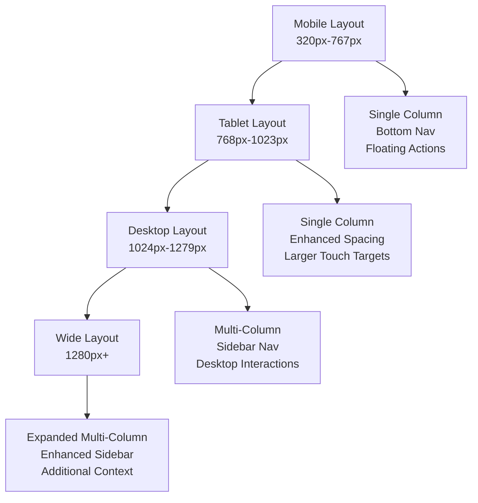
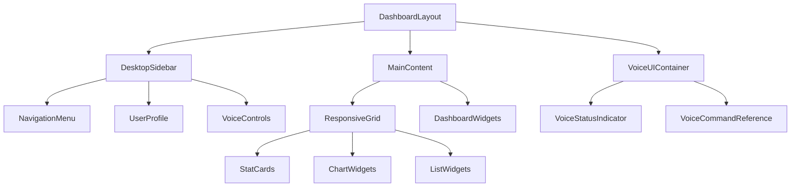

# Design Document

## Overview

This design transforms VyaparMitra's mobile-first dashboards into desktop-optimized experiences while maintaining the existing voice-first commerce principles and responsive design foundation. The solution implements progressive enhancement from single-column mobile layouts to multi-column desktop layouts, with enhanced navigation, improved information density, and desktop-appropriate voice UI positioning.

The design leverages VyaparMitra's existing responsive design system (breakpoints: mobile 320px, tablet 768px, desktop 1024px, wide 1280px) and extends it with desktop-specific layout patterns, sidebar navigation, and enhanced data visualization components.

## Architecture

### Responsive Layout System

The architecture follows a mobile-first progressive enhancement approach:



### Component Hierarchy



### Breakpoint Strategy

The design uses VyaparMitra's existing breakpoint system with enhanced desktop layouts:

- **Mobile (320px-767px)**: Existing single-column layouts maintained
- **Tablet (768px-1023px)**: Enhanced mobile layouts with larger spacing
- **Desktop (1024px-1279px)**: 2-column grid with sidebar navigation
- **Wide (1280px+)**: 3-column grid with expanded sidebar and additional context

## Components and Interfaces

### 1. DashboardLayout Component

**Purpose**: Main layout wrapper that adapts between mobile and desktop layouts

**Interface**:
```typescript
interface DashboardLayoutProps {
  children: React.ReactNode;
  userType: 'customer' | 'vendor';
  currentPage: string;
  showSidebar?: boolean;
  sidebarCollapsed?: boolean;
  onSidebarToggle?: () => void;
}
```

**Responsive Behavior**:
- Mobile/Tablet: Uses existing PageLayout with bottom navigation
- Desktop/Wide: Implements sidebar + main content layout
- Smooth transitions between breakpoints using CSS Grid and Flexbox

### 2. DesktopSidebar Component

**Purpose**: Collapsible sidebar navigation for desktop screens

**Interface**:
```typescript
interface DesktopSidebarProps {
  userType: 'customer' | 'vendor';
  currentPage: string;
  collapsed: boolean;
  onToggle: () => void;
  voiceActive: boolean;
  onVoiceToggle: () => void;
}
```

**Features**:
- Expandable/collapsible with smooth animations
- User type-specific navigation items
- Integrated voice controls
- User profile section
- Keyboard navigation support

### 3. ResponsiveGrid Component

**Purpose**: Adaptive grid system for dashboard widgets

**Interface**:
```typescript
interface ResponsiveGridProps {
  children: React.ReactNode;
  columns?: {
    mobile: number;
    tablet: number;
    desktop: number;
    wide: number;
  };
  gap?: 'sm' | 'md' | 'lg';
  autoFit?: boolean;
}
```

**Default Configuration**:
- Mobile: 1 column
- Tablet: 1-2 columns based on content
- Desktop: 2 columns
- Wide: 3 columns

### 4. Enhanced Dashboard Widgets

#### StatCard Component
```typescript
interface StatCardProps {
  title: string;
  value: string | number;
  change?: {
    value: string;
    trend: 'up' | 'down' | 'neutral';
  };
  icon: React.ReactNode;
  size?: 'compact' | 'default' | 'expanded';
}
```

#### ChartWidget Component
```typescript
interface ChartWidgetProps {
  title: string;
  data: any[];
  type: 'line' | 'bar' | 'pie' | 'area';
  height?: {
    mobile: number;
    desktop: number;
  };
  showLegend?: boolean;
  responsive?: boolean;
}
```

#### ListWidget Component
```typescript
interface ListWidgetProps {
  title: string;
  items: any[];
  renderItem: (item: any) => React.ReactNode;
  maxItems?: {
    mobile: number;
    desktop: number;
  };
  showViewAll?: boolean;
  onViewAll?: () => void;
}
```

### 5. Voice UI Integration

#### DesktopVoiceControls Component
```typescript
interface DesktopVoiceControlsProps {
  isActive: boolean;
  isListening: boolean;
  onToggle: () => void;
  position: 'sidebar' | 'header' | 'floating';
  size?: 'sm' | 'md' | 'lg';
}
```

**Positioning Strategy**:
- Desktop: Integrated into sidebar header
- Wide screens: Dedicated voice panel in sidebar
- Fallback: Floating action button (existing mobile pattern)

## Data Models

### Dashboard Configuration

```typescript
interface DashboardConfig {
  layout: {
    type: 'mobile' | 'desktop';
    columns: number;
    sidebar: {
      enabled: boolean;
      collapsed: boolean;
      width: number;
    };
  };
  widgets: DashboardWidget[];
  voiceUI: {
    position: 'sidebar' | 'header' | 'floating';
    enabled: boolean;
    showCommands: boolean;
  };
}

interface DashboardWidget {
  id: string;
  type: 'stat' | 'chart' | 'list' | 'custom';
  title: string;
  size: {
    mobile: { cols: number; rows: number };
    desktop: { cols: number; rows: number };
  };
  data: any;
  config: Record<string, any>;
}
```

### Responsive Breakpoint Context

```typescript
interface BreakpointContext {
  current: 'mobile' | 'tablet' | 'desktop' | 'wide';
  width: number;
  height: number;
  isMobile: boolean;
  isTablet: boolean;
  isDesktop: boolean;
  isWide: boolean;
}
```

### Navigation Configuration

```typescript
interface NavigationConfig {
  items: NavigationItem[];
  userType: 'customer' | 'vendor';
  currentPage: string;
}

interface NavigationItem {
  id: string;
  label: string;
  icon: React.ReactNode;
  path: string;
  badge?: {
    count: number;
    variant: 'default' | 'destructive' | 'secondary';
  };
  children?: NavigationItem[];
}
```

## Correctness Properties

*A property is a characteristic or behavior that should hold true across all valid executions of a system—essentially, a formal statement about what the system should do. Properties serve as the bridge between human-readable specifications and machine-verifiable correctness guarantees.*

### Property 1: Responsive Layout Adaptation
*For any* viewport width, the Dashboard_System should display the appropriate layout (single-column below 1024px, 2-column at 1024px+, 3-column at 1280px+) with smooth transitions and no content jumping.
**Validates: Requirements 1.1, 1.2, 1.3, 1.4**

### Property 2: Navigation System Responsiveness
*For any* breakpoint, the Navigation_System should display the appropriate navigation pattern (bottom nav below 1024px, sidebar at 1024px+) while preserving user state and providing proper interaction feedback.
**Validates: Requirements 2.1, 2.2, 2.3, 2.4, 2.5, 10.2**

### Property 3: Grid Layout Consistency
*For any* dashboard widget arrangement, the Widget_System should maintain proper grid alignment, consistent card heights within rows, and appropriate column counts based on viewport width.
**Validates: Requirements 3.1, 3.2, 3.3, 3.4, 3.5**

### Property 4: Analytics Dashboard Enhancement
*For any* analytics component, the Analytics_Dashboard should display enhanced visualizations and additional contextual information on desktop while maintaining data update stability.
**Validates: Requirements 4.1, 4.2, 4.3, 4.4, 4.5**

### Property 5: Voice UI Desktop Integration
*For any* screen size, the Voice_UI should position controls appropriately (sidebar/header on desktop, floating on mobile) while maintaining accessibility and providing proper visual feedback.
**Validates: Requirements 5.1, 5.2, 5.3, 5.4, 5.5**

### Property 6: Information Density Optimization
*For any* increase in available screen space, the Dashboard_System should display more content per screen while maintaining adequate whitespace, visual hierarchy, and readability.
**Validates: Requirements 6.1, 6.2, 6.3, 6.4, 6.5**

### Property 7: Desktop Interaction Pattern Support
*For any* interactive element on desktop, the Dashboard_System should provide hover states, keyboard navigation, appropriate click feedback, and desktop-optimized tooltips and drag interactions where applicable.
**Validates: Requirements 7.1, 7.2, 7.3, 7.4, 7.5**

### Property 8: Responsive Typography and Spacing
*For any* text content or UI element, the Dashboard_System should use typography and spacing that scales appropriately with screen size while maintaining optimal line lengths and reading comfort.
**Validates: Requirements 8.1, 8.2, 8.3, 8.4, 8.5**

### Property 9: Desktop Touch Target Optimization
*For any* interactive element on desktop screens, the Dashboard_System should provide larger touch targets and hover states optimized for mouse interaction while maintaining mobile touch target requirements below 1024px.
**Validates: Requirements 1.5**

### Property 10: Performance and Accessibility Preservation
*For any* layout transformation or desktop enhancement, the Dashboard_System should maintain fast loading times, WCAG 2.1 compliance, proper semantic markup, logical tab order, high contrast support, and respect for reduced motion preferences.
**Validates: Requirements 9.1, 9.2, 9.3, 9.4, 9.5**

### Property 11: Feature Parity and Graceful Degradation
*For any* dashboard functionality, the Dashboard_System should provide the same core features across all device types with appropriate adaptations, graceful degradation of desktop features to mobile alternatives, and preservation of mobile functionality when desktop enhancements are added.
**Validates: Requirements 10.1, 10.3, 10.4, 10.5**

## Error Handling

### Layout Fallback Strategy

1. **Breakpoint Detection Failure**:
   - Fallback to mobile layout
   - Log error for monitoring
   - Provide manual layout toggle

2. **Sidebar Rendering Issues**:
   - Gracefully degrade to mobile bottom navigation
   - Maintain core navigation functionality
   - Display user notification about layout limitations

3. **Grid Layout Failures**:
   - Fallback to single-column layout
   - Preserve widget functionality
   - Log layout errors for debugging

4. **Voice UI Integration Errors**:
   - Maintain voice functionality with fallback positioning
   - Ensure voice controls remain accessible
   - Provide alternative access methods

### Performance Degradation Handling

1. **Slow Rendering**:
   - Implement progressive loading for complex widgets
   - Show skeleton states during transitions
   - Optimize re-renders with React.memo and useMemo

2. **Memory Constraints**:
   - Lazy load non-critical desktop enhancements
   - Implement virtual scrolling for large lists
   - Clean up unused components and event listeners

### Accessibility Fallbacks

1. **Screen Reader Compatibility**:
   - Provide alternative text descriptions for layout changes
   - Maintain logical tab order across breakpoints
   - Ensure all interactive elements remain keyboard accessible

2. **High Contrast Mode**:
   - Verify all layout elements remain visible
   - Provide alternative visual indicators
   - Maintain sufficient color contrast ratios

## Testing Strategy

### Unit Testing Approach

**Component Testing**:
- Test responsive behavior of individual components
- Verify prop handling across different screen sizes
- Test accessibility features (keyboard navigation, ARIA attributes)
- Test error states and fallback behaviors

**Hook Testing**:
- Test custom hooks for breakpoint detection
- Verify layout state management
- Test voice UI integration hooks

**Utility Testing**:
- Test responsive utility functions
- Verify grid calculation logic
- Test layout transformation functions

### Property-Based Testing Configuration

**Testing Framework**: Use React Testing Library with Jest and @testing-library/jest-dom
**Property Test Library**: Use fast-check for property-based testing
**Minimum Iterations**: 100 per property test
**Test Environment**: jsdom with viewport simulation

**Property Test Examples**:

```typescript
// Property 1: Responsive Layout Consistency
test('Property 1: Layout consistency across breakpoints', () => {
  fc.assert(fc.property(
    fc.integer({ min: 320, max: 1920 }), // viewport width
    (width) => {
      const { container } = render(
        <DashboardLayout userType="customer" currentPage="dashboard">
          <div>Test Content</div>
        </DashboardLayout>
      );
      
      // Simulate viewport width change
      Object.defineProperty(window, 'innerWidth', {
        writable: true,
        configurable: true,
        value: width,
      });
      window.dispatchEvent(new Event('resize'));
      
      // Verify essential elements remain accessible
      const mainContent = container.querySelector('[data-testid="main-content"]');
      const navigation = container.querySelector('[data-testid="navigation"]');
      
      expect(mainContent).toBeInTheDocument();
      expect(navigation).toBeInTheDocument();
      expect(mainContent).toBeVisible();
      expect(navigation).toBeVisible();
    }
  ), { numRuns: 100 });
});
```

### Integration Testing

**Cross-Browser Testing**:
- Test responsive behavior in Chrome, Firefox, Safari, Edge
- Verify CSS Grid and Flexbox support
- Test touch and mouse interactions

**Device Testing**:
- Test on actual devices when possible
- Use browser dev tools for responsive simulation
- Verify performance on lower-end devices

**Voice UI Integration**:
- Test voice controls across different layouts
- Verify voice command accessibility
- Test voice status indicators

### End-to-End Testing

**User Journey Testing**:
- Test complete user flows across breakpoints
- Verify data persistence during layout changes
- Test navigation between dashboard sections

**Performance Testing**:
- Measure layout shift (CLS) during responsive transitions
- Test loading times for desktop-enhanced layouts
- Monitor memory usage during extended sessions

**Accessibility Testing**:
- Automated testing with axe-core
- Manual testing with screen readers
- Keyboard-only navigation testing
- High contrast mode verification

### Testing Checklist

**Responsive Behavior**:
- [ ] Layout adapts correctly at all breakpoints
- [ ] Content remains accessible during transitions
- [ ] No horizontal scrolling on any screen size
- [ ] Touch targets meet minimum size requirements

**Desktop Enhancements**:
- [ ] Sidebar navigation functions correctly
- [ ] Multi-column layouts display properly
- [ ] Hover states work on interactive elements
- [ ] Keyboard navigation follows logical order

**Voice UI Integration**:
- [ ] Voice controls positioned appropriately
- [ ] Voice status indicators scale correctly
- [ ] Voice commands remain accessible
- [ ] Voice UI doesn't interfere with main content

**Performance**:
- [ ] Layout transitions are smooth (60fps)
- [ ] Initial load time remains acceptable
- [ ] Memory usage stays within reasonable bounds
- [ ] No significant performance regression on mobile

**Accessibility**:
- [ ] WCAG 2.1 AA compliance maintained
- [ ] Screen reader compatibility verified
- [ ] Keyboard navigation works correctly
- [ ] Color contrast ratios meet standards
- [ ] Focus indicators are visible and appropriate