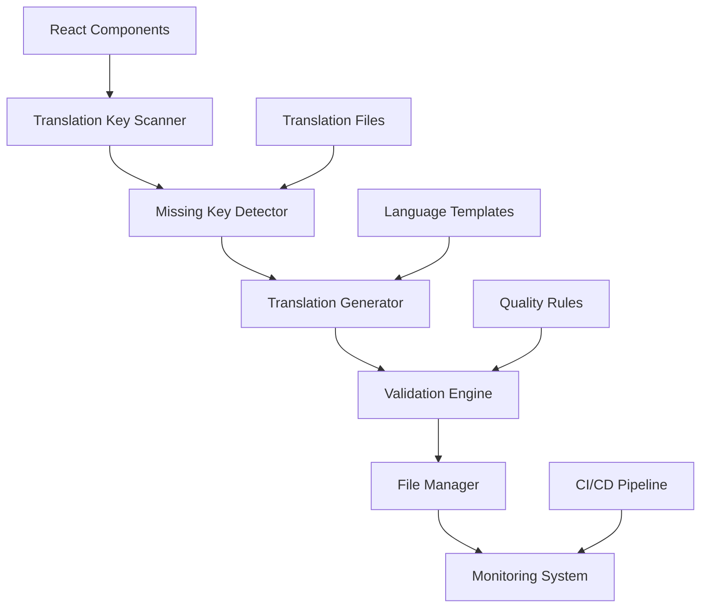

# Design Document

## Overview

The i18n Translation Completeness System is designed to systematically identify, audit, and fix missing translation keys across VyaparMitra's React frontend. The system addresses the current issue where missing translation keys cause console errors and display key names instead of translated text, particularly affecting vendor dashboard functionality.

The solution consists of automated discovery tools, validation systems, and management utilities that ensure complete translation coverage across all 12 supported Indian languages while maintaining the existing i18next framework and project structure.

## Architecture

### System Components



### Core Architecture Principles

1. **Non-Intrusive Integration**: Works with existing i18next setup without requiring code changes
2. **Automated Discovery**: Scans codebase automatically to find translation key usage
3. **Batch Processing**: Handles all 12 languages simultaneously for consistency
4. **Validation-First**: Ensures quality and completeness before file updates
5. **CI/CD Integration**: Prevents deployment of incomplete translations

## Components and Interfaces

### Translation Key Scanner

**Purpose**: Discovers all translation keys used throughout the React application

**Implementation**:
```typescript
interface TranslationKeyScanner {
  scanDirectory(path: string): Promise<ScanResult>;
  extractKeysFromFile(filePath: string): TranslationKey[];
  parseReactComponent(content: string): TranslationKey[];
  parseHookUsage(content: string): TranslationKey[];
}

interface TranslationKey {
  key: string;
  filePath: string;
  lineNumber: number;
  context: string;
  hasParameters: boolean;
  parameters: string[];
}

interface ScanResult {
  totalFiles: number;
  totalKeys: number;
  keysByFile: Map<string, TranslationKey[]>;
  keysByNamespace: Map<string, TranslationKey[]>;
}
```

**Key Features**:
- Regex-based extraction of `t('key')` and `t("key")` patterns
- Support for nested keys with dot notation
- Parameter detection for interpolation syntax
- Context extraction for better translation quality

### Missing Key Detector

**Purpose**: Compares discovered keys against existing translation files

**Implementation**:
```typescript
interface MissingKeyDetector {
  detectMissingKeys(scanResult: ScanResult): Promise<MissingKeyReport>;
  loadTranslationFiles(): Promise<TranslationFileMap>;
  compareKeysAcrossLanguages(keys: TranslationKey[]): LanguageComparisonResult;
}

interface MissingKeyReport {
  totalMissingKeys: number;
  missingByLanguage: Map<string, string[]>;
  missingByNamespace: Map<string, MissingKeyInfo[]>;
  priorityKeys: string[];
  vendorSpecificKeys: string[];
}

interface MissingKeyInfo {
  key: string;
  usageCount: number;
  affectedLanguages: string[];
  priority: 'high' | 'medium' | 'low';
  namespace: string;
}
```

**Priority Classification**:
- **High**: Vendor dashboard, authentication, core navigation
- **Medium**: Product management, order history, settings
- **Low**: Help text, tooltips, secondary features

### Translation Generator

**Purpose**: Creates appropriate translations for missing keys across all languages

**Implementation**:
```typescript
interface TranslationGenerator {
  generateTranslations(missingKeys: string[]): Promise<GeneratedTranslations>;
  createPlaceholderTranslations(keys: string[]): TranslationMap;
  applyTranslationTemplates(keys: string[], templates: TemplateMap): TranslationMap;
}

interface GeneratedTranslations {
  translations: Map<string, Map<string, string>>; // language -> key -> translation
  placeholders: string[];
  templateApplied: string[];
  requiresManualReview: string[];
}

interface TranslationTemplate {
  pattern: RegExp;
  translations: Map<string, string>; // language -> template
  parameters: string[];
}
```

**Translation Strategy**:
1. **Template Matching**: Use predefined templates for common patterns
2. **Context-Aware Generation**: Generate based on namespace and usage context
3. **Parameter Preservation**: Maintain interpolation syntax across languages
4. **Placeholder Creation**: Generate meaningful placeholders for manual review

### Validation Engine

**Purpose**: Ensures translation quality and completeness

**Implementation**:
```typescript
interface ValidationEngine {
  validateTranslationFiles(): Promise<ValidationReport>;
  checkKeyConsistency(translations: TranslationFileMap): ConsistencyReport;
  validateParameterMatching(key: string, translations: Map<string, string>): boolean;
  checkJSONStructure(filePath: string): StructureValidationResult;
}

interface ValidationReport {
  isValid: boolean;
  errors: ValidationError[];
  warnings: ValidationWarning[];
  completionPercentage: Map<string, number>; // language -> percentage
  missingCriticalKeys: string[];
}

interface ValidationError {
  type: 'missing_key' | 'invalid_json' | 'parameter_mismatch' | 'empty_translation';
  key?: string;
  language?: string;
  message: string;
  severity: 'error' | 'warning';
}
```

**Validation Rules**:
- All keys used in code must exist in all language files
- Parameter interpolation must match across languages
- JSON structure must be valid and consistent
- Critical vendor keys cannot be empty or placeholder text

### File Manager

**Purpose**: Safely updates translation files while preserving existing content

**Implementation**:
```typescript
interface FileManager {
  updateTranslationFile(language: string, updates: TranslationUpdates): Promise<void>;
  backupTranslationFiles(): Promise<string>; // returns backup path
  restoreFromBackup(backupPath: string): Promise<void>;
  mergeTranslations(existing: TranslationMap, updates: TranslationMap): TranslationMap;
}

interface TranslationUpdates {
  additions: Map<string, string>;
  modifications: Map<string, string>;
  deletions: string[];
  preserveComments: boolean;
}
```

**Safety Features**:
- Automatic backup before any modifications
- Atomic file operations to prevent corruption
- Preservation of existing translations and formatting
- Rollback capability for failed operations

### Monitoring System

**Purpose**: Provides ongoing monitoring and prevents regression

**Implementation**:
```typescript
interface MonitoringSystem {
  setupBuildTimeValidation(): void;
  createPreCommitHook(): void;
  generateCompletionReport(): Promise<CompletionReport>;
  trackTranslationUsage(): Promise<UsageReport>;
}

interface CompletionReport {
  overallCompletion: number;
  languageCompletion: Map<string, number>;
  namespaceCompletion: Map<string, number>;
  recentChanges: TranslationChange[];
  recommendations: string[];
}
```

## Data Models

### Translation File Structure

```typescript
interface TranslationFile {
  [namespace: string]: {
    [key: string]: string | TranslationFile;
  };
}

// Example structure
interface VendorTranslations {
  vendor: {
    dashboard: {
      title: string;
      welcome: string;
      stats: {
        totalProducts: string;
        activeNegotiations: string;
        todaysSales: string;
        totalRevenue: string;
        inventoryValue: string;
      };
      quickActions: {
        addProduct: string;
        viewOrders: string;
        manageInventory: string;
        generateQR: string;
        analytics: string;
        voiceSettings: string;
      };
      sections: {
        businessOverview: string;
        quickActions: string;
        shopLocation: string;
        qrCode: string;
        activeNegotiations: string;
        yourProducts: string;
        inventoryAnalytics: string;
        profitabilityAnalysis: string;
        negotiationPerformance: string;
        recentOrders: string;
        fastMovingItems: string;
        reorderRecommendations: string;
        voiceVsTextPerformance: string;
      };
      negotiations: {
        noActive: string;
        newWillAppear: string;
        viewAll: string;
        addNew: string;
        accept: string;
        counter: string;
        reject: string;
        customerOffer: string;
        yourPrice: string;
      };
      voice: {
        ready: string;
        listening: string;
        tryVoice: string;
        stop: string;
      };
      analytics: {
        successRate: string;
        avgTime: string;
        avgDiscount: string;
        totalNegotiations: string;
        voice: string;
        text: string;
        revenue: string;
        profit: string;
        roi: string;
        loadingAnalytics: string;
        salesPerDay: string;
        daysLeft: string;
        current: string;
        recommended: string;
        margin: string;
        negotiations: string;
      };
      language: {
        chooseLanguage: string;
      };
    };
  };
}
```

### Configuration Schema

```typescript
interface TranslationConfig {
  languages: string[];
  sourceDirectory: string;
  translationDirectory: string;
  excludePatterns: string[];
  priorityNamespaces: string[];
  validationRules: ValidationRule[];
  templates: TranslationTemplate[];
  backupDirectory: string;
}

interface ValidationRule {
  name: string;
  type: 'required' | 'format' | 'consistency';
  pattern?: RegExp;
  severity: 'error' | 'warning';
  message: string;
}
```

## Correctness Properties

*A property is a characteristic or behavior that should hold true across all valid executions of a system-essentially, a formal statement about what the system should do. Properties serve as the bridge between human-readable specifications and machine-verifiable correctness guarantees.*

Now I'll analyze the acceptance criteria to determine which are testable as properties:

### Property Reflection

After analyzing all acceptance criteria, I identified several areas where properties can be consolidated:

**Redundancy Analysis:**
- Properties 1.1, 5.1 both test codebase scanning - can be combined into one comprehensive scanning property
- Properties 3.1, 4.1, 4.3 all test key validation - can be combined into one validation property  
- Properties 6.1, 6.5 both test console error prevention - can be combined
- Properties 6.2, 6.3, 6.4, 7.1, 7.2, 7.3, 7.4 all test UI translation display - can be combined into comprehensive display property
- Properties 8.3, 8.4, 8.5 all test file structure maintenance - can be combined

**Consolidated Properties:**
- **Translation Key Discovery**: Combines scanning and extraction capabilities
- **Missing Key Detection**: Combines detection across languages and validation
- **Translation File Management**: Combines file updates, structure, and consistency
- **UI Translation Display**: Combines all user-facing translation display requirements
- **Build Integration**: Combines build-time and test-time validation

### Correctness Properties

Property 1: **Translation Key Discovery Completeness**
*For any* React codebase containing translation keys, the scanner should discover all keys used in components, hooks, and utility files, correctly extracting key names, parameters, and usage context
**Validates: Requirements 1.1, 5.1**

Property 2: **Missing Key Detection Accuracy**  
*For any* set of discovered translation keys and existing translation files, the detector should correctly identify which keys are missing from which language files across all 12 supported languages
**Validates: Requirements 1.2, 3.1**

Property 3: **Translation File Update Consistency**
*For any* set of missing translation keys, when adding translations, all 12 language files should be updated with appropriate translations while preserving existing content and maintaining valid JSON structure
**Validates: Requirements 2.1, 2.3, 5.3**

Property 4: **Parameter Interpolation Preservation**
*For any* translation key containing parameter interpolation syntax (e.g., {{name}}, {{count}}), the system should preserve the exact parameter syntax across all language translations
**Validates: Requirements 2.4, 3.4**

Property 5: **Validation Report Accuracy**
*For any* translation file set, the validator should generate accurate completion percentages, correctly identify placeholder translations, and report all structural inconsistencies
**Validates: Requirements 3.2, 3.5, 4.5**

Property 6: **JSON Structure Integrity**
*For any* translation file operations (additions, updates, reorganization), the resulting files should maintain valid JSON syntax and consistent nested object hierarchy across all languages
**Validates: Requirements 3.3, 8.4**

Property 7: **Build Integration Validation**
*For any* codebase with missing critical translation keys, the build process should fail with clear error messages indicating which keys are missing and from which files
**Validates: Requirements 4.2, 4.4**

Property 8: **Console Error Elimination**
*For any* application state (loading, navigation, language switching), the translation system should not generate console errors and should display proper translated text instead of key names
**Validates: Requirements 6.1, 6.2, 6.3, 6.5**

Property 9: **Vendor Dashboard Translation Completeness**
*For any* vendor dashboard interaction (accessing sections, viewing analytics, managing negotiations, using voice features), all UI elements should display properly translated text appropriate for business users
**Validates: Requirements 7.1, 7.2, 7.3, 7.4**

Property 10: **Translation Structure Organization**
*For any* set of translation keys, the system should organize them under logical namespaces, follow established naming conventions, and maintain alphabetical ordering within each namespace across all language files
**Validates: Requirements 8.1, 8.2, 8.5**

Property 11: **Placeholder Translation Generation**
*For any* missing translation key, the system should generate meaningful placeholder translations for all 12 languages that can be easily identified for manual review
**Validates: Requirements 5.2**

Property 12: **Priority Classification Accuracy**
*For any* translation key, the system should correctly classify its priority level based on namespace and usage context, with vendor-related keys receiving high priority
**Validates: Requirements 1.3, 1.4**

## Error Handling

### Error Categories

1. **File System Errors**
   - Translation file not found or inaccessible
   - Permission denied when writing files
   - Disk space insufficient for backup operations

2. **Parsing Errors**
   - Invalid JSON syntax in translation files
   - Malformed React component code
   - Unrecognized translation key patterns

3. **Validation Errors**
   - Missing critical translation keys
   - Parameter mismatch across languages
   - Circular dependencies in nested keys

4. **Integration Errors**
   - Build process failures
   - CI/CD pipeline integration issues
   - Version control conflicts

### Error Recovery Strategies

```typescript
interface ErrorRecoveryStrategy {
  handleFileSystemError(error: FileSystemError): Promise<RecoveryResult>;
  handleParsingError(error: ParsingError): Promise<RecoveryResult>;
  handleValidationError(error: ValidationError): Promise<RecoveryResult>;
  rollbackChanges(backupPath: string): Promise<void>;
}

interface RecoveryResult {
  success: boolean;
  message: string;
  suggestedActions: string[];
  requiresManualIntervention: boolean;
}
```

**Recovery Mechanisms**:
- Automatic backup and rollback for file operations
- Graceful degradation when translation files are corrupted
- Fallback to English translations when target language is unavailable
- Detailed logging for debugging and manual intervention

## Testing Strategy

### Dual Testing Approach

The system requires both unit tests and property-based tests to ensure comprehensive coverage:

**Unit Tests Focus**:
- Specific file parsing scenarios with known inputs/outputs
- Edge cases like empty files, malformed JSON, special characters
- Integration points between scanner, detector, and file manager
- Error handling for specific failure scenarios

**Property-Based Tests Focus**:
- Universal properties that hold for all translation key sets
- Comprehensive input coverage through randomization
- Validation of system behavior across all 12 languages
- Structural consistency across different file organizations

### Property-Based Testing Configuration

**Framework**: Use `fast-check` for TypeScript property-based testing
**Test Configuration**: Minimum 100 iterations per property test
**Test Tagging**: Each property test references its design document property

Example property test structure:
```typescript
// Feature: i18n-translation-completeness, Property 1: Translation Key Discovery Completeness
describe('Translation Key Discovery', () => {
  it('should discover all translation keys in any React codebase', () => {
    fc.assert(fc.property(
      fc.array(reactComponentGenerator()),
      (components) => {
        const scanner = new TranslationKeyScanner();
        const result = scanner.scanComponents(components);
        
        // Property: All keys used in components should be discovered
        const expectedKeys = extractExpectedKeys(components);
        expect(result.discoveredKeys).toContainAllKeys(expectedKeys);
      }
    ), { numRuns: 100 });
  });
});
```

### Testing Data Generators

```typescript
// Generators for property-based testing
const translationKeyGenerator = () => fc.string().filter(s => s.includes('.'));
const reactComponentGenerator = () => fc.record({
  content: fc.string(),
  translationKeys: fc.array(translationKeyGenerator()),
  hasParameters: fc.boolean()
});
const translationFileGenerator = () => fc.dictionary(
  translationKeyGenerator(),
  fc.string()
);
```

### Integration Testing

**Build Pipeline Testing**:
- Test CI/CD integration with missing keys
- Verify build failure scenarios
- Test rollback mechanisms

**End-to-End Testing**:
- Full workflow from key discovery to file updates
- Multi-language consistency validation
- User interface translation display verification

**Performance Testing**:
- Large codebase scanning performance
- Memory usage during bulk operations
- File I/O optimization validation