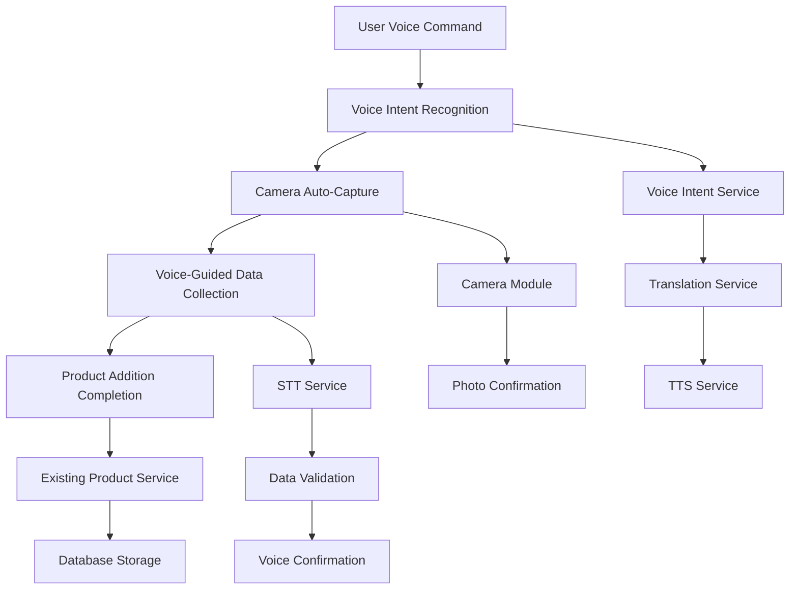

# Design Document

## Overview

This design document outlines the implementation of a voice-first product addition workflow for VyaparMitra. The feature transforms the existing manual AddProduct page into a voice-driven experience where users can say "add product" in any of the 12 supported languages to trigger automatic camera capture and voice-guided data collection for quantity and price information.

The design leverages VyaparMitra's existing voice processing infrastructure, including the Voice_Intent_System, TTS_Service, STT_Service, and Translation_Service, while extending the current AddProduct page with new voice-first capabilities.

## Architecture

### High-Level Architecture



### Component Integration

The voice-first workflow integrates with existing VyaparMitra components:

- **Voice Intent System**: Extended to handle ADD_PRODUCT workflow states
- **AddProduct Page**: Enhanced with voice-first UI and camera integration
- **Translation Service**: Provides multilingual voice prompts and responses
- **TTS/STT Services**: Handle voice input/output throughout the workflow
- **Camera Module**: New component for automatic photo capture
- **Product Service**: Existing backend service for product creation

## Components and Interfaces

### 1. Enhanced Voice Intent Service

**Location**: `src/services/voice_intent.ts`

**New Workflow States**:
```typescript
export enum VoiceWorkflowState {
  IDLE = 'idle',
  PHOTO_CAPTURE = 'photo_capture',
  PHOTO_CONFIRMATION = 'photo_confirmation',
  QUANTITY_INPUT = 'quantity_input',
  QUANTITY_CONFIRMATION = 'quantity_confirmation',
  PRICE_INPUT = 'price_input',
  PRICE_CONFIRMATION = 'price_confirmation',
  COMPLETION = 'completion'
}

export interface VoiceProductWorkflow {
  sessionId: string;
  userId: string;
  language: string;
  state: VoiceWorkflowState;
  data: {
    photo?: string;
    quantity?: number;
    price?: number;
    productName?: string;
  };
  createdAt: Date;
  updatedAt: Date;
  expiresAt: Date;
}
```

**Extended Intent Processing**:
```typescript
export class VoiceIntentService {
  static async processProductAdditionWorkflow(
    intent: string,
    entities: Record<string, any>,
    sessionId: string,
    language: string
  ): Promise<VoiceWorkflowResponse> {
    // Handle workflow state transitions
    // Generate appropriate voice prompts
    // Manage session data
  }
}
```

### 2. Camera Integration Module

**Location**: `client/src/components/VoiceCameraCapture.tsx`

**Interface**:
```typescript
export interface CameraModule {
  capturePhoto(): Promise<CaptureResult>;
  retakePhoto(): Promise<CaptureResult>;
  confirmPhoto(photoData: string): Promise<boolean>;
}

export interface CaptureResult {
  success: boolean;
  photoData?: string;
  error?: string;
  retryCount: number;
}
```

**Implementation Strategy**:
- Uses browser's `navigator.mediaDevices.getUserMedia()` API
- Automatic capture after 2-second countdown
- Photo preview with confirm/retake options
- Fallback to manual upload if camera fails

### 3. Enhanced AddProduct Page

**Location**: `client/src/pages/AddProduct.tsx`

**New State Management**:
```typescript
interface AddProductState {
  mode: 'manual' | 'voice';
  voiceWorkflow: {
    active: boolean;
    state: VoiceWorkflowState;
    sessionId?: string;
    language: string;
  };
  formData: ProductFormData;
  cameraState: {
    active: boolean;
    photo?: string;
    capturing: boolean;
  };
  voiceState: {
    listening: boolean;
    speaking: boolean;
    currentPrompt?: string;
  };
}
```

**Voice-First UI Components**:
- Voice status indicator with waveform animation
- Camera overlay with automatic capture countdown
- Voice prompt display with multilingual support
- Fallback controls for manual input when needed

### 4. Voice Workflow Service

**Location**: `src/services/voice_workflow_service.ts`

**New Service**:
```typescript
export class VoiceWorkflowService {
  async createWorkflowSession(
    userId: string,
    language: string
  ): Promise<VoiceProductWorkflow>;
  
  async updateWorkflowState(
    sessionId: string,
    newState: VoiceWorkflowState,
    data?: Partial<VoiceProductWorkflow['data']>
  ): Promise<VoiceProductWorkflow>;
  
  async getWorkflowSession(sessionId: string): Promise<VoiceProductWorkflow | null>;
  
  async completeWorkflow(sessionId: string): Promise<boolean>;
  
  async cleanupExpiredSessions(): Promise<number>;
}
```

### 5. Voice Prompt Generator

**Location**: `src/services/voice_prompt_generator.ts`

**Multilingual Prompt Templates**:
```typescript
export class VoicePromptGenerator {
  private static readonly prompts = {
    photo_captured: {
      en: "Photo captured! Is this the product you want to add?",
      hi: "फोटो खींची गई! क्या यह वह प्रोडक्ट है जिसे आप जोड़ना चाहते हैं?",
      // ... other languages
    },
    quantity_request: {
      en: "Please tell me the quantity of this product.",
      hi: "कृपया मुझे इस प्रोडक्ट की मात्रा बताएं।",
      // ... other languages
    },
    price_request: {
      en: "What is the price per unit for this product?",
      hi: "इस प्रोडक्ट की प्रति यूनिट कीमत क्या है?",
      // ... other languages
    }
  };
  
  static generatePrompt(
    promptType: string,
    language: string,
    context?: Record<string, any>
  ): string;
}
```

## Data Models

### Voice Workflow Session Storage

**Redis Schema** (temporary session data):
```typescript
interface VoiceWorkflowRedisData {
  sessionId: string;
  userId: string;
  language: string;
  state: VoiceWorkflowState;
  data: {
    photo?: string; // Base64 encoded image
    quantity?: number;
    price?: number;
    productName?: string;
  };
  createdAt: string;
  expiresAt: string; // 5 minutes from creation
}
```

**PostgreSQL Schema** (audit and analytics):
```sql
CREATE TABLE voice_workflow_sessions (
  id UUID PRIMARY KEY DEFAULT gen_random_uuid(),
  user_id UUID NOT NULL REFERENCES users(id),
  session_id VARCHAR(255) UNIQUE NOT NULL,
  language VARCHAR(5) NOT NULL,
  initial_state VARCHAR(50) NOT NULL,
  final_state VARCHAR(50),
  workflow_data JSONB,
  completed BOOLEAN DEFAULT FALSE,
  created_at TIMESTAMP DEFAULT NOW(),
  completed_at TIMESTAMP,
  duration_seconds INTEGER
);

CREATE INDEX idx_voice_workflow_user_id ON voice_workflow_sessions(user_id);
CREATE INDEX idx_voice_workflow_session_id ON voice_workflow_sessions(session_id);
```

### Enhanced Product Model

**Existing product creation remains unchanged** - the voice workflow populates the same ProductFormData structure:

```typescript
interface ProductFormData {
  name: string;
  price: string;
  unit: string;
  stock: string;
  description: string;
  category: string;
  images?: string[]; // Enhanced to support voice-captured photos
  voiceCreated?: boolean; // Flag to track voice-created products
  language?: string; // Language used during creation
}
```

## Correctness Properties

*A property is a characteristic or behavior that should hold true across all valid executions of a system-essentially, a formal statement about what the system should do. Properties serve as the bridge between human-readable specifications and machine-verifiable correctness guarantees.*

### Property Reflection

After analyzing all acceptance criteria, I identified several areas where properties can be consolidated to eliminate redundancy:

**Consolidation Areas:**
1. **Language Consistency**: Properties 1.4, 4.1, and 4.5 all relate to maintaining language context - can be combined into one comprehensive property
2. **Retry Logic**: Properties 1.5, 2.3, and 7.1 all involve retry mechanisms with specific limits - can be unified under error handling patterns
3. **Service Integration**: Properties 6.1, 6.2, and 6.5 all relate to backend service consistency - can be combined
4. **Performance Timing**: Properties 8.1-8.4 all measure response times - can be grouped under performance requirements
5. **Fallback Mechanisms**: Properties 7.2, 7.3, 7.4, and 7.5 all handle service degradation - can be unified

**Final Property Set** (after consolidation):

### Property 1: Multilingual Intent Recognition
*For any* voice command containing "add product" in any of the 12 supported languages, the Voice_Intent_System should recognize it as Product_Addition_Intent with confidence above 0.7
**Validates: Requirements 1.1**

### Property 2: Workflow State Consistency  
*For any* voice workflow session, once a language is detected, all subsequent prompts, confirmations, and error messages should remain in that same language throughout the entire session
**Validates: Requirements 1.4, 4.1, 4.5**

### Property 3: Camera Automation Timing
*For any* confirmed Product_Addition_Intent, the Camera_Module should automatically activate and capture a photo within 2 seconds
**Validates: Requirements 2.1**

### Property 4: Retry Logic Consistency
*For any* service failure (voice recognition, camera capture, or STT processing), the system should retry exactly the specified number of times (3 for voice, 2 for camera, 3 for STT) before offering fallback options
**Validates: Requirements 1.5, 2.3, 7.1**

### Property 5: Workflow State Progression
*For any* voice workflow session, completing a required step (photo confirmation, quantity input, price input) should automatically advance to the next state and generate appropriate voice prompts
**Validates: Requirements 2.4, 3.1, 3.3, 5.2**

### Property 6: Voice Data Conversion Accuracy
*For any* voice input containing numeric values (quantity or price), the STT_Service should convert speech to the correct numeric format and confirm the value with the user before proceeding
**Validates: Requirements 3.2, 3.4**

### Property 7: Currency Context Preservation
*For any* price-related voice prompt in any supported language, the prompt should include appropriate Indian currency context (rupees, ₹, or local currency terms)
**Validates: Requirements 4.3**

### Property 8: Session State Persistence
*For any* interrupted voice workflow session, the system should preserve all collected data (photo, quantity, price) for exactly 5 minutes and provide a summary when resumed
**Validates: Requirements 5.3, 5.4**

### Property 9: Backend Service Consistency
*For any* product created through voice workflow, the data should be stored using identical database schemas and API endpoints as manual product creation, with additional voice-specific metadata
**Validates: Requirements 6.1, 6.2, 6.5**

### Property 10: Graceful Service Degradation
*For any* voice service failure (TTS, STT, Translation, or Camera), the system should provide appropriate fallback mechanisms while maintaining workflow continuity where possible
**Validates: Requirements 7.2, 7.3, 7.4, 7.5**

### Property 11: Performance Response Times
*For any* voice workflow operation, response times should meet specified thresholds: intent recognition < 1s, camera capture < 2s, TTS start < 500ms, STT processing < 1.5s
**Validates: Requirements 8.1, 8.2, 8.3, 8.4**

### Property 12: End-to-End Workflow Completion
*For any* complete voice workflow with valid inputs (clear voice commands, successful photo capture, valid quantity and price), the entire product addition process should complete within 30 seconds
**Validates: Requirements 8.5**

<function_calls>
<invoke name="prework">
<parameter name="featureName">voice-first-product-addition

## Error Handling

### Voice Service Error Handling

**Intent Recognition Failures**:
- Low confidence scores (< 0.7): Request clarification in user's language
- Complete recognition failure: Retry up to 3 times with different prompts
- Persistent failures: Graceful fallback to manual mode with explanation

**TTS Service Degradation**:
- Primary TTS failure: Automatic fallback to secondary TTS model
- Complete TTS failure: Display text prompts while maintaining voice input capability
- Cache TTS responses to reduce service dependency

**STT Service Issues**:
- Unclear speech recognition: Request repetition with helpful guidance
- Numeric conversion errors: Provide examples in user's language
- Complete STT failure: Offer manual input while preserving workflow state

### Camera Integration Error Handling

**Camera Access Issues**:
- Permission denied: Clear instructions for enabling camera access
- Hardware unavailable: Immediate fallback to manual photo upload
- Capture failures: Automatic retry with user feedback

**Photo Quality Validation**:
- Blurry or dark images: Automatic retake with improved lighting guidance
- Invalid image formats: Graceful handling with format conversion
- Large file sizes: Automatic compression while preserving quality

### Translation Service Resilience

**BHASHINI Service Failures**:
- API timeouts: Automatic retry with exponential backoff
- Service unavailable: Fallback to cached translations or secondary services
- Translation quality issues: Confidence scoring and manual review triggers

**Language Detection Errors**:
- Ambiguous language input: Request explicit language selection
- Unsupported language variants: Fallback to closest supported language
- Mixed language input: Detect primary language and proceed

### Workflow State Recovery

**Session Interruption Handling**:
- Network disconnections: Automatic session restoration on reconnection
- Browser refresh: State recovery from Redis cache
- Timeout scenarios: Partial data preservation with user notification

**Data Validation Errors**:
- Invalid quantity values: Clear error messages with valid range examples
- Price format issues: Automatic formatting with user confirmation
- Missing required data: Step-by-step guidance to complete workflow

## Testing Strategy

### Dual Testing Approach

The testing strategy employs both unit tests and property-based tests to ensure comprehensive coverage:

**Unit Tests**: Focus on specific examples, edge cases, and integration points
- Voice intent recognition with known phrases
- Camera capture success/failure scenarios  
- Translation service fallback mechanisms
- UI component behavior in different states
- Error handling for specific failure modes

**Property-Based Tests**: Verify universal properties across all inputs
- Voice command recognition across language variations
- Workflow state consistency throughout sessions
- Performance timing requirements under load
- Data integrity between voice and manual workflows
- Service degradation and recovery patterns

### Property-Based Testing Configuration

**Testing Framework**: Fast-check for TypeScript property-based testing
**Minimum Iterations**: 100 iterations per property test
**Test Tagging**: Each property test references its design document property

**Example Property Test Structure**:
```typescript
describe('Voice-First Product Addition Properties', () => {
  it('Property 1: Multilingual Intent Recognition', () => {
    fc.assert(fc.property(
      fc.oneof(...generateAddProductPhrases()),
      fc.constantFrom(...supportedLanguages),
      async (phrase, language) => {
        const result = await VoiceIntentService.processVoiceIntent({
          audioData: mockAudioBuffer(phrase),
          userLanguage: language
        });
        
        expect(result.intent).toBe('ADD_PRODUCT');
        expect(result.confidence).toBeGreaterThan(0.7);
      }
    ), { numRuns: 100 });
  });
});
```

**Property Test Tags**:
- **Feature: voice-first-product-addition, Property 1**: Multilingual Intent Recognition
- **Feature: voice-first-product-addition, Property 2**: Workflow State Consistency
- **Feature: voice-first-product-addition, Property 3**: Camera Automation Timing
- And so on for all 12 properties...

### Integration Testing Strategy

**Voice Workflow Integration**:
- End-to-end workflow testing with real voice services
- Cross-language workflow validation
- Service failure simulation and recovery testing
- Performance testing under concurrent user load

**Camera Integration Testing**:
- Browser compatibility testing across devices
- Permission handling in different environments
- Photo capture quality validation
- Fallback mechanism verification

**Backend Integration Testing**:
- Database consistency between voice and manual workflows
- API endpoint compatibility testing
- Session management and cleanup validation
- Audit trail completeness verification

### Performance Testing Requirements

**Load Testing Scenarios**:
- Concurrent voice workflow sessions (target: 100 simultaneous users)
- Voice service response time validation
- Database performance under voice workflow load
- Redis session storage performance

**Stress Testing**:
- Voice service failure recovery under load
- Camera capture performance with multiple users
- Translation service throughput testing
- End-to-end workflow completion rates

### Test Environment Configuration

**Development Testing**:
- Mock voice services for fast feedback
- Simulated camera capture for CI/CD
- In-memory Redis for unit tests
- Test database with sample data

**Staging Testing**:
- Real voice services with test API keys
- Actual camera integration testing
- Production-like database setup
- Full translation service integration

**Production Monitoring**:
- Real-time performance metrics
- Error rate monitoring and alerting
- User experience analytics
- Voice workflow completion tracking

This comprehensive testing strategy ensures the voice-first product addition workflow meets all performance, reliability, and user experience requirements while maintaining compatibility with VyaparMitra's existing infrastructure.