# VyaparMitra - AI-Powered Voice Commerce Platform

VyaparMitra is a revolutionary voice-first e-commerce platform that enables seamless price negotiations between vendors and customers through AI-assisted voice interactions, multilingual support, and intelligent automation.

## 🎯 Complete User Experience Journey

### 🛍️ Customer Experience

#### 1. Welcome & Language Selection
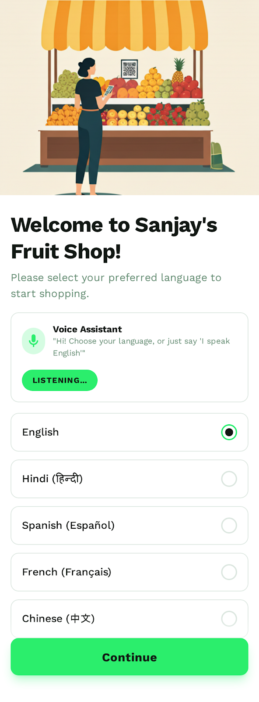
*Multilingual onboarding with voice-guided setup*

#### 2. Permissions & Voice Setup
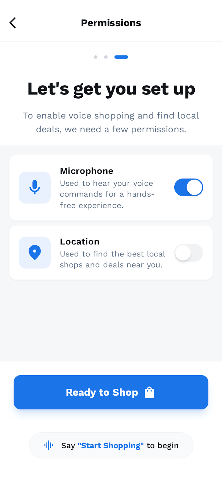
*Voice permissions and accessibility configuration*

#### 3. Shop Browser with Voice Assistant
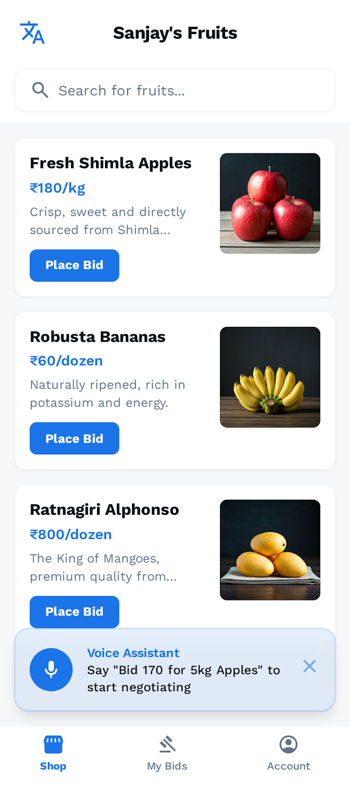
*Voice-enabled product browsing with AI assistant*

#### 4. Voice-Powered Negotiation

*Real-time voice negotiations with AI assistance*

#### 5. Deal Confirmation & Success
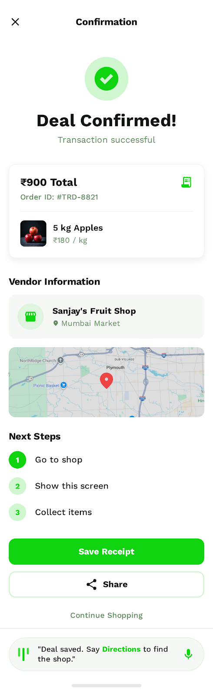
*Transaction completion with voice confirmation*

### 🏪 Vendor Experience

#### 1. Vendor Dashboard with Voice AI
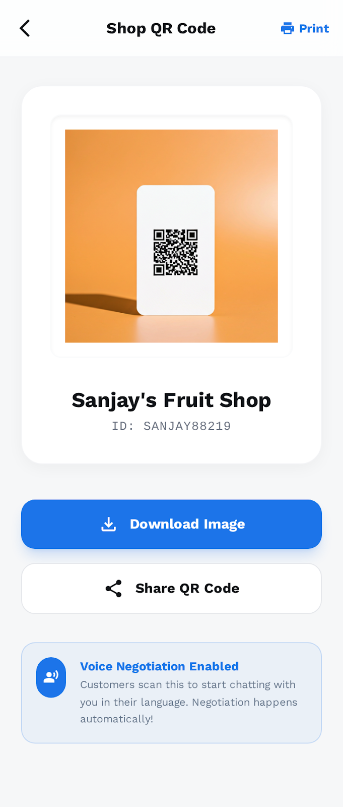
*Comprehensive vendor management with voice controls*

#### 2. AI-Assisted Negotiation Interface
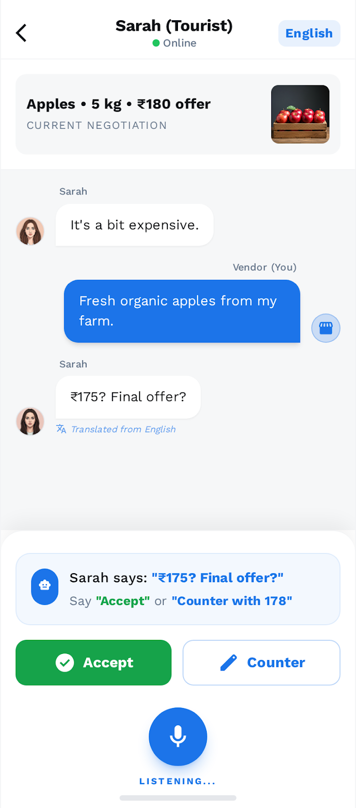
*Intelligent negotiation assistance for vendors*

#### 3. Voice-Enabled Product Management

*Hands-free product catalog management*

#### 4. Order History with Voice AI

*Voice-accessible transaction history and analytics*

## 🎙️ Advanced Voice Features

### Voice Customization & AI Settings
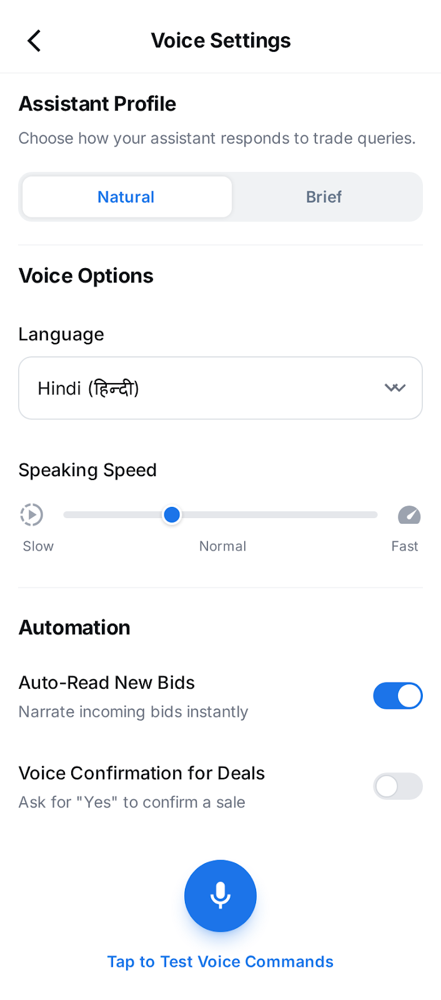
*Personalized AI voice configuration*

### Advanced Voice Accessibility
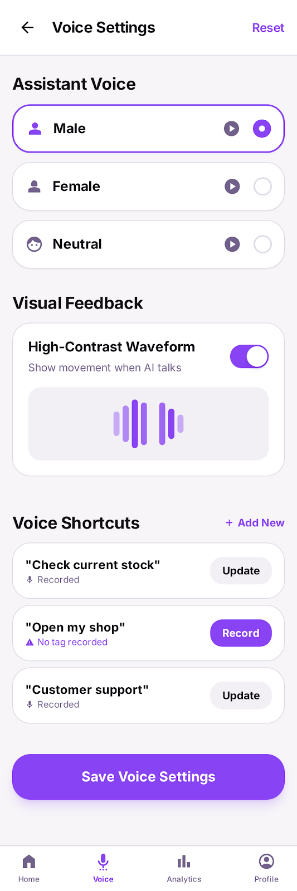
*Comprehensive accessibility features for all users*

### Hands-Free Mode Settings
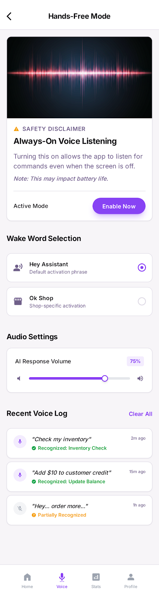
*Always-on voice interaction configuration*

### Voice Assistant Settings
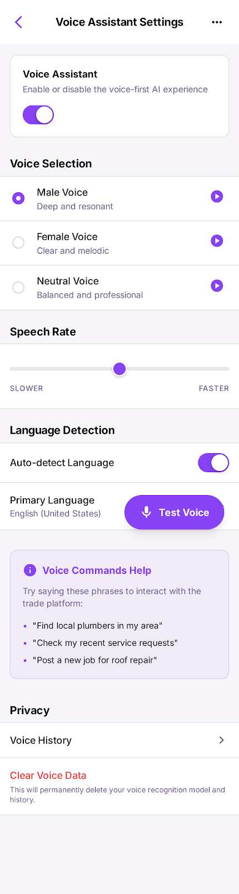
*Detailed voice assistant customization*

## 📱 Interactive Guides & Help

### Voice-First How-To Guide
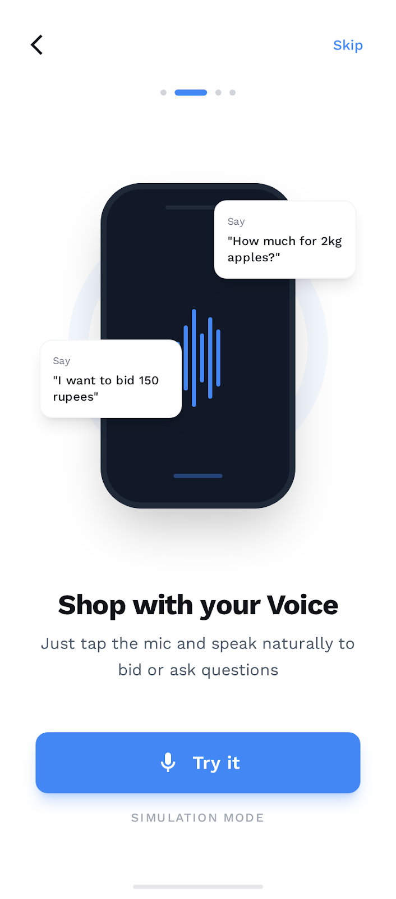
*Interactive voice tutorials and onboarding*

### Voice Commands Reference
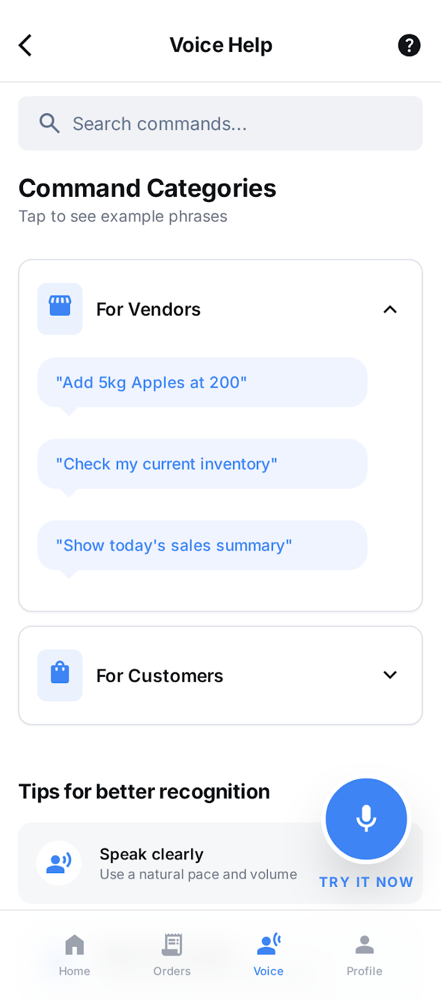
*Comprehensive voice command documentation*

### Interactive Voice Guide
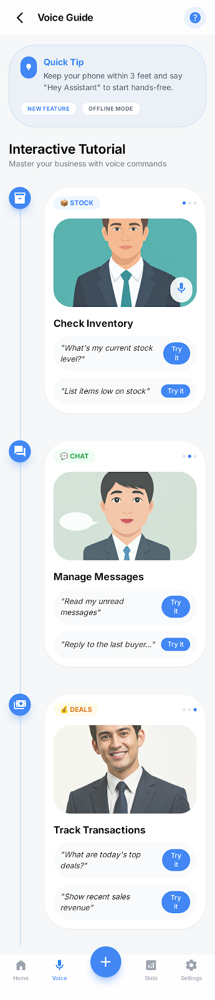
*Step-by-step voice interaction tutorials*

## 🔧 System States & Feedback

### Voice Transaction States
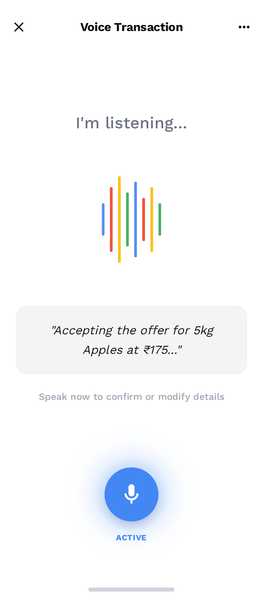
*Real-time transaction processing with voice feedback*

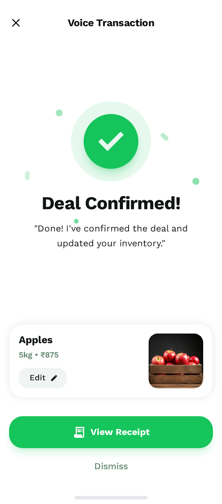
*Voice-confirmed successful transactions*

### Error Handling & Offline Support
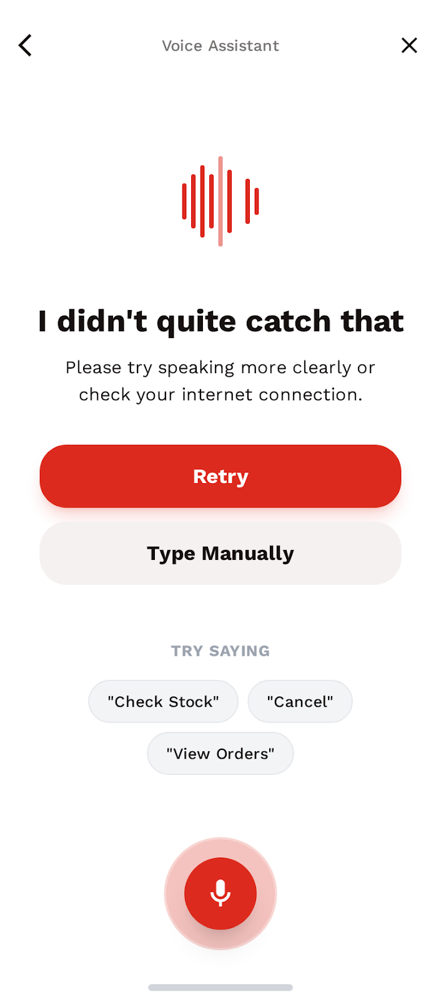
*Intelligent error handling with voice guidance*

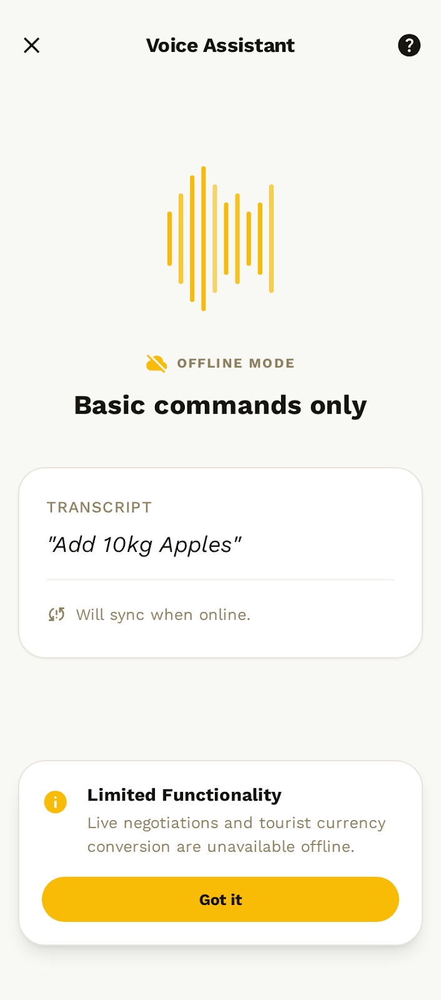
*Offline voice interaction capabilities*

### System Synchronization
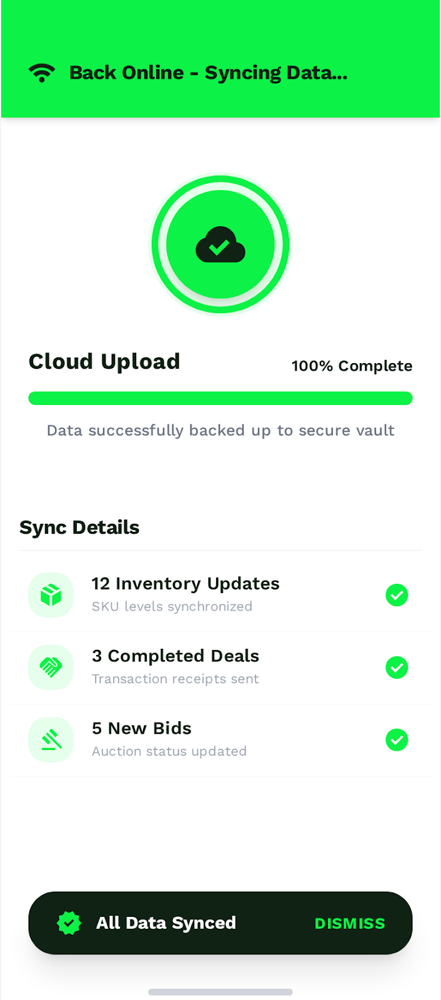
*Real-time data synchronization with voice feedback*

## 🏪 Business Tools & Analytics

### Customer Bids Dashboard
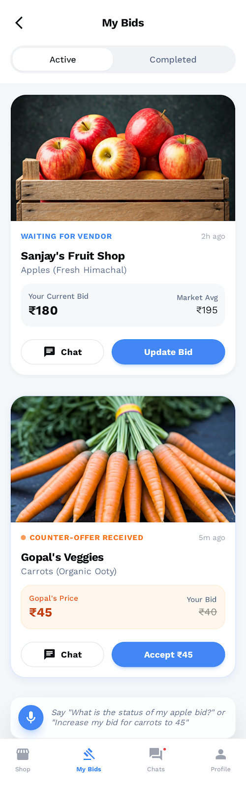
*Real-time bid tracking and management*

### QR Code Integration
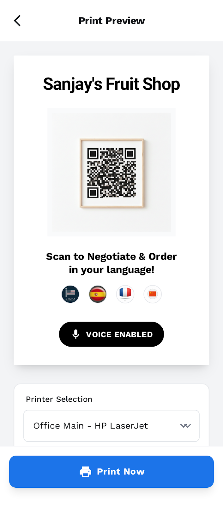
*Printable QR codes for physical store integration*

### Vendor Status Management
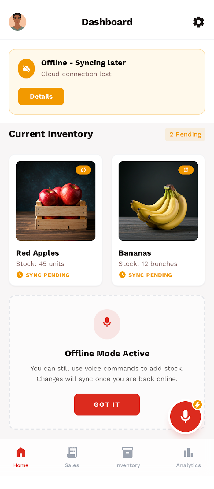
*Comprehensive vendor status and availability management*

## ⚙️ Unified Settings & Automation

### Voice & Automation Settings
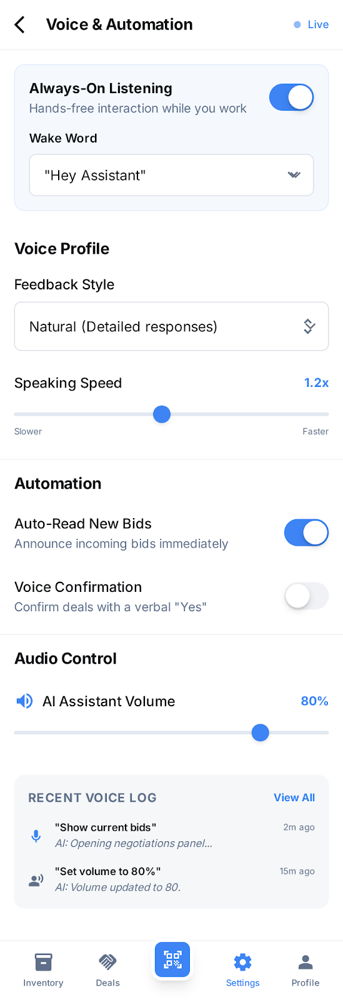
*Centralized voice and automation configuration*

## 🌟 Key Features

### Core Voice Commerce Capabilities
- **AI-Powered Voice Negotiations**: Real-time voice-based price negotiations with intelligent AI assistance
- **Multilingual Voice Support**: 12+ Indian and Southeast Asian languages with natural voice processing
- **Voice-First Interface**: Complete hands-free operation for accessibility and convenience
- **Intelligent Voice Assistant**: Context-aware AI that understands commerce intent and assists both parties
- **Voice Cloning & Personalization**: Custom voice profiles for personalized shopping experiences
- **Real-time Voice Translation**: Seamless cross-language negotiations with voice-to-voice translation

### Advanced Commerce Features
- **Smart Inventory Management**: Voice-controlled product catalog with intelligent stock tracking
- **AI-Assisted Pricing**: Dynamic pricing suggestions based on market data and negotiation patterns
- **Voice Analytics**: Comprehensive voice interaction analytics and success metrics
- **Offline Voice Capabilities**: Local voice processing for uninterrupted service
- **QR Code Integration**: Seamless physical-to-digital store transitions
- **Voice-Enabled Payments**: Secure voice-confirmed transaction processing

## 🏗️ Technical Architecture

### Technology Stack
- **Frontend**: React 18 + TypeScript + Vite + Tailwind CSS
- **Voice Processing**: Web Speech API + Custom Audio Worklets
- **UI Components**: Radix UI + Framer Motion + Lucide Icons
- **State Management**: TanStack Query + React Hooks
- **Backend**: Node.js + TypeScript + Express.js
- **GraphQL**: Apollo Server with real-time subscriptions
- **Databases**: 
  - PostgreSQL (negotiations, bids, transactions)
  - MongoDB (vendors, products, users, voice profiles)
  - Redis (caching, sessions, stock locks)
- **AI/ML**: 
  - BHASHINI API (translation)
  - Tacotron + HiFi-GAN (TTS)
  - SV2TTS (voice cloning)
  - Meta Voicebox (multilingual TTS)

### Project Structure
```
├── client/                 # React frontend application
│   ├── src/
│   │   ├── components/     # Reusable UI components
│   │   ├── pages/          # Route-based page components
│   │   ├── hooks/          # Custom React hooks
│   │   └── lib/            # Utility libraries
├── server/                 # Express.js backend
├── src/                    # Core business logic
│   ├── config/             # Configuration management
│   ├── db/                 # Database connections
│   ├── graphql/            # GraphQL resolvers
│   ├── services/           # Business logic services
│   ├── voice/              # Voice processing modules
│   └── utils/              # Utility functions
└── shared/                 # Shared types and schemas
```

## 🚀 Implementation Status

### ✅ Fully Implemented Pages
- **Home/Shop Browser** (`/`) - Customer product browsing with voice assistant
- **AI-Assisted Chat** (`/chat/:id`) - Vendor-side negotiation interface  
- **Customer Voice Negotiation** (`/customer-chat/:id`) - Customer-side negotiation
- **Deal Confirmation** (`/confirmation/:id`) - Success page with receipt
- **Vendor Dashboard** (`/vendor`) - Complete vendor management interface
- **Voice Settings** (`/voice-settings`) - Advanced voice accessibility
- **Voice Customization** (`/voice-customization`) - AI voice configuration
- **Hands-Free Settings** (`/hands-free-settings`) - Always-on voice listening
- **Add Product** (`/add-product`) - Voice-enabled product entry
- **Order History** (`/order-history`) - Transaction history with voice AI

### 🎨 Available Design Templates
All designs from the Stitch AI collection are available for implementation:
- Customer Bids Dashboard
- Voice Commands Reference Guide
- Interactive Voice Guide
- Voice Recognition Error States
- Voice Transaction Animations
- Offline Voice Interaction States
- QR Code Integration
- Vendor Status Management
- Unified Settings Interface

## 🚀 Quick Start

### Prerequisites
- Node.js 18+ 
- PostgreSQL 14+
- MongoDB 6+
- Redis 7+

### Installation

1. **Clone the repository**
```bash
git clone https://github.com/uday68/VyaparMitra.git
cd VyaparMitra
```

2. **Install dependencies**
```bash
npm install
```

3. **Set up environment variables**
```bash
cp .env.example .env
# Edit .env with your database credentials and API keys
```

4. **Set up databases**
```bash
# PostgreSQL - create database
createdb vyapar_mitra

# MongoDB - will be created automatically
# Redis - should be running on default port
```

5. **Start the development servers**
```bash
# Start both frontend and backend in development mode
npm run dev

# Or start them separately:
npm run dev:client    # Frontend on http://localhost:5173
npm run dev:server    # Backend on http://localhost:4000
```

The application will be available at:
- **Frontend**: `http://localhost:5173` (React app)
- **Backend API**: `http://localhost:4000/api` (REST endpoints)
- **GraphQL Playground**: `http://localhost:4000/graphql`
- **WebSocket**: `ws://localhost:4000/graphql`

### Production Build
```bash
npm run build
npm start
```

## 🎯 Voice Commerce Features

### Customer Journey
1. **Voice Onboarding**: Multilingual welcome with voice-guided setup
2. **Voice Shopping**: Browse products using natural voice commands
3. **Voice Negotiations**: Real-time price negotiations with AI assistance
4. **Voice Confirmation**: Complete transactions with voice verification
5. **Voice History**: Access order history through voice queries

### Vendor Tools
1. **Voice Dashboard**: Manage inventory and orders hands-free
2. **AI Negotiation Assistant**: Get intelligent pricing suggestions
3. **Voice Analytics**: Track performance through voice queries
4. **Voice Product Management**: Add/edit products using voice commands
5. **Voice Customer Service**: Handle customer inquiries with AI support

### Accessibility Features
- **Screen Reader Support**: Full compatibility with assistive technologies
- **Voice-Only Navigation**: Complete app functionality without visual interface
- **High Contrast Mode**: Enhanced visibility for visually impaired users
- **Large Touch Targets**: Optimized for users with motor impairments
- **Multilingual Voice**: Support for 12+ languages with natural pronunciation

## 📚 API Documentation

### Frontend Routes
- `/` - Home/Shop Browser (Customer product browsing)
- `/chat/:id` - AI-Assisted Negotiation (Vendor interface)
- `/customer-chat/:id` - Customer Voice Negotiation
- `/confirmation/:id` - Deal Confirmation & Receipt
- `/vendor` - Vendor Dashboard with Voice AI
- `/voice-settings` - Advanced Voice Accessibility Settings
- `/voice-customization` - AI Voice Configuration
- `/hands-free-settings` - Always-On Voice Mode
- `/add-product` - Voice-Enabled Product Management
- `/order-history` - Transaction History with Voice AI

### REST API Endpoints

#### Products
- `GET /api/products` - List products with voice search filters
- `GET /api/products/:id` - Get product details with voice description
- `POST /api/products` - Create new product (voice-enabled)
- `PATCH /api/products/:id` - Update product (voice commands)
- `DELETE /api/products/:id` - Delete product with voice confirmation

#### Negotiations
- `POST /api/negotiations` - Start voice-based negotiation
- `GET /api/negotiations` - List user negotiations with voice status
- `GET /api/negotiations/:id` - Get negotiation details with voice history
- `POST /api/negotiations/:id/bids` - Create voice bid
- `POST /api/negotiations/:id/accept` - Voice-confirm bid acceptance
- `POST /api/negotiations/:id/reject` - Voice-reject bid with reason

#### Voice & AI Services
- `POST /api/voice/intent` - Process voice command and extract intent
- `POST /api/voice/tts` - Generate speech from text (multilingual)
- `POST /api/voice/profile` - Create/update voice profile for cloning
- `POST /api/voice/negotiate` - AI-assisted negotiation suggestions
- `GET /api/voice/commands` - Get available voice commands list

#### Translation & Localization
- `POST /api/translate` - Real-time voice translation
- `GET /api/languages` - Supported languages for voice processing
- `POST /api/voice/transcribe` - Convert speech to text

#### QR Sessions & Integration
- `POST /api/qr/session` - Create QR session for vendor
- `GET /api/qr/session/:id` - Validate and join QR session
- `POST /api/qr/scan` - Process QR code scan with voice feedback

### GraphQL Schema

Real-time subscriptions for voice commerce:
- `negotiationCreated` - New voice negotiation started
- `bidCreated` - New voice bid placed with audio
- `bidAccepted` - Voice-confirmed bid acceptance
- `bidRejected` - Voice-rejected bid with reason
- `voiceCommandProcessed` - Voice command processing status
- `translationCompleted` - Real-time translation updates

### Voice Command Examples

#### Customer Commands
```
"Show me apples under 100 rupees"
"I want to buy 2 kg mangoes"
"Can you reduce the price to 80 rupees?"
"Accept this deal"
"What's my order history?"
```

#### Vendor Commands
```
"Add new product: Fresh bananas, 50 rupees per kg"
"Show today's negotiations"
"Accept the customer's offer"
"Set price to 45 rupees"
"Show my inventory status"
```

## 🔧 Configuration

### Environment Variables

Key configuration options in `.env`:

```bash
# Database URLs
MONGODB_URI=mongodb://localhost:27017/vyapar-mitra
POSTGRES_URI=postgresql://localhost:5432/vyapar_mitra
REDIS_URL=redis://localhost:6379

# BHASHINI Translation API
BHASHINI_API_KEY=your_api_key
BHASHINI_BASE_URL=https://bhashini.gov.in/api

# Voice & TTS Configuration
TTS_MODEL=tacotron|voicebox|sv2tts
VOICE_CLONING_ENABLED=true|false
VOICE_RECOGNITION_LANGUAGE=auto|hi|en|bn|ta
VOICE_SYNTHESIS_QUALITY=high|medium|low

# AI & ML Services
OPENAI_API_KEY=your_openai_key
NEGOTIATION_AI_MODEL=gpt-4|gpt-3.5-turbo
VOICE_INTENT_CONFIDENCE_THRESHOLD=0.8

# Security & Authentication
JWT_SECRET=your-secret-key
VOICE_CONSENT_REQUIRED=true|false
SESSION_TIMEOUT=3600

# Frontend Configuration
VITE_API_BASE_URL=http://localhost:4000
VITE_WS_URL=ws://localhost:4000
VITE_VOICE_ENABLED=true
VITE_OFFLINE_MODE=true
```

### Supported Languages & Voice Features

#### Primary Languages (Full Voice Support)
- **Hindi (hi)** - Native TTS + Voice Recognition + Translation
- **English (en)** - Native TTS + Voice Recognition + Translation
- **Bengali (bn)** - Native TTS + Voice Recognition + Translation
- **Tamil (ta)** - Native TTS + Voice Recognition + Translation
- **Telugu (te)** - Native TTS + Voice Recognition + Translation

#### Additional Languages (Translation + Basic Voice)
- Kannada (kn), Malayalam (ml), Marathi (mr)
- Oriya (or), Punjabi (pa), Assamese (as)
- Gujarati (gu), Urdu (ur)

#### Voice Capabilities by Language
- **Voice Recognition**: Real-time speech-to-text
- **Voice Synthesis**: Natural text-to-speech
- **Voice Cloning**: Personalized voice profiles
- **Voice Translation**: Cross-language voice conversations
- **Voice Commands**: Natural language intent processing

## 🎯 Usage Examples

### Voice-Based Negotiation Flow

```javascript
// Start voice negotiation
const negotiation = await fetch('/api/negotiations', {
  method: 'POST',
  headers: { 'Content-Type': 'application/json' },
  body: JSON.stringify({
    vendorId: 'vendor123',
    customerId: 'customer456', 
    productId: 'product789',
    voiceEnabled: true,
    language: 'hi'
  })
});

// Process voice command
const voiceResult = await fetch('/api/voice/intent', {
  method: 'POST',
  headers: { 'Content-Type': 'application/json' },
  body: JSON.stringify({
    text: 'मैं 500 रुपये में यह उत्पाद खरीदना चाहता हूं',
    language: 'hi',
    userId: 'user123',
    userType: 'customer',
    context: 'negotiation'
  })
});

// Real-time voice translation
const translation = await fetch('/api/translate', {
  method: 'POST',
  headers: { 'Content-Type': 'application/json' },
  body: JSON.stringify({
    text: 'Can you reduce the price?',
    fromLanguage: 'en',
    toLanguage: 'hi',
    voiceOutput: true
  })
});
```

### Voice Assistant Integration

```javascript
// Initialize voice assistant
const voiceAssistant = new VoiceAssistant({
  language: 'hi',
  voiceEnabled: true,
  continuousListening: true,
  wakeWord: 'Hey VyaparMitra'
});

// Handle voice commands
voiceAssistant.onCommand((command) => {
  switch(command.intent) {
    case 'BROWSE_PRODUCTS':
      navigateToProducts(command.entities);
      break;
    case 'START_NEGOTIATION':
      startNegotiation(command.entities);
      break;
    case 'ACCEPT_OFFER':
      acceptCurrentOffer();
      break;
  }
});

// Voice-enabled product search
const searchProducts = async (voiceQuery) => {
  const response = await fetch('/api/products', {
    method: 'GET',
    headers: {
      'Voice-Query': voiceQuery,
      'Language': 'hi'
    }
  });
  return response.json();
};
```

### Real-time Voice Negotiation

```javascript
// WebSocket subscription for voice negotiations
const subscription = client.subscribe({
  query: VOICE_NEGOTIATION_SUBSCRIPTION,
  variables: { negotiationId: 123 }
}).subscribe({
  next: (data) => {
    const { voiceBid, audioUrl, transcript, translation } = data.bidCreated;
    
    // Play voice message
    playAudio(audioUrl);
    
    // Show transcript
    displayTranscript(transcript);
    
    // Show translation if needed
    if (translation) {
      displayTranslation(translation);
    }
    
    // Update negotiation UI
    updateNegotiationState(voiceBid);
  }
});
```

## 🔒 Security & Privacy Features

### Voice Data Protection
- **Voice Consent Management**: Explicit consent for voice recording and processing
- **Local Voice Processing**: Offline voice recognition to protect privacy
- **Voice Data Encryption**: End-to-end encryption for voice communications
- **Voice Profile Security**: Secure storage and access control for voice clones
- **Audio Data Retention**: Configurable retention policies for voice recordings

### Authentication & Authorization
- **JWT-based Authentication**: Secure token-based user authentication
- **Role-based Access Control**: Vendor/Customer role separation
- **Voice Biometric Authentication**: Optional voice-based user verification
- **Session Management**: Secure session handling with voice confirmation
- **API Rate Limiting**: Protection against abuse and spam

### Data Security
- **Input Validation**: Comprehensive validation for all voice and text inputs
- **SQL Injection Prevention**: Parameterized queries and ORM protection
- **XSS Protection**: Content Security Policy and input sanitization
- **CORS Configuration**: Proper cross-origin resource sharing setup
- **Secure File Upload**: Safe handling of audio files and voice profiles

## 📊 Voice Analytics & Monitoring

### Voice Interaction Metrics
- **Voice Command Success Rate**: Accuracy of voice recognition and intent processing
- **Negotiation Completion Rate**: Success rate of voice-based negotiations
- **Language Usage Statistics**: Popular languages and regional preferences
- **Voice Quality Metrics**: Audio clarity and processing performance
- **User Engagement**: Voice interaction frequency and duration

### Business Intelligence
- **Voice Commerce Conversion**: Voice-to-purchase conversion rates
- **Popular Voice Commands**: Most used voice interactions
- **Negotiation Patterns**: Voice negotiation success patterns
- **Customer Satisfaction**: Voice interaction satisfaction scores
- **Vendor Performance**: Voice-enabled vendor success metrics

### System Performance
- **Voice Processing Latency**: Real-time voice processing performance
- **Translation Accuracy**: Cross-language translation quality
- **TTS Quality Metrics**: Voice synthesis naturalness scores
- **Offline Mode Usage**: Local voice processing statistics
- **Error Rate Monitoring**: Voice recognition and processing errors

## � Testing

### Automated Testing
```bash
# Run all tests
npm test

# Run with coverage
npm run test:coverage

# Run voice-specific tests
npm run test:voice

# Run integration tests
npm run test:integration
```

### Voice Testing
```bash
# Test voice recognition accuracy
npm run test:voice-recognition

# Test TTS quality
npm run test:tts

# Test multilingual support
npm run test:languages

# Test voice commands
npm run test:voice-commands
```

### Manual Testing Checklist
- [ ] Voice recognition in all supported languages
- [ ] Voice synthesis quality and naturalness
- [ ] Cross-language voice translation
- [ ] Voice command intent recognition
- [ ] Offline voice processing
- [ ] Voice-based navigation
- [ ] Accessibility with screen readers
- [ ] Voice error handling and recovery

## 🚀 Deployment

### Docker Deployment
```bash
# Build and run with Docker Compose
docker-compose up -d

# Build individual services
docker build -t vyapar-mitra-client ./client
docker build -t vyapar-mitra-server ./server
```

### Production Environment Setup
```bash
# Install production dependencies
npm ci --production

# Build frontend
npm run build:client

# Build backend
npm run build:server

# Start production server
npm run start:prod
```

### Cloud Deployment Considerations

#### Voice Processing Infrastructure
- **CDN for Audio Files**: Fast delivery of voice recordings and TTS audio
- **Voice Processing Servers**: Dedicated servers for real-time voice processing
- **Load Balancing**: Distribute voice processing load across multiple servers
- **Edge Computing**: Local voice processing for reduced latency

#### Database Scaling
- **PostgreSQL Read Replicas**: Scale negotiation and transaction queries
- **MongoDB Sharding**: Distribute voice profiles and product catalogs
- **Redis Clustering**: High-availability caching and session management
- **Voice Data Storage**: Secure, scalable storage for voice recordings

#### Monitoring & Observability
- **Voice Quality Monitoring**: Real-time voice processing quality metrics
- **Performance Tracking**: Voice latency and accuracy monitoring
- **Error Tracking**: Voice recognition and processing error logging
- **User Experience Monitoring**: Voice interaction success tracking

## 🤝 Contributing

### Development Setup
1. Fork the repository
2. Create a feature branch (`git checkout -b feature/voice-enhancement`)
3. Set up development environment with voice testing tools
4. Make your changes with comprehensive voice testing
5. Add tests for voice functionality
6. Commit your changes (`git commit -m 'Add voice enhancement feature'`)
7. Push to the branch (`git push origin feature/voice-enhancement`)
8. Open a Pull Request with voice testing results

### Voice Feature Development Guidelines
- **Voice Privacy First**: Always implement privacy-by-design for voice features
- **Multilingual Support**: Ensure new features work across all supported languages
- **Accessibility**: Test with screen readers and assistive technologies
- **Offline Capability**: Consider offline voice processing where possible
- **Performance**: Optimize for real-time voice processing requirements

### Testing Requirements
- Unit tests for voice processing functions
- Integration tests for voice API endpoints
- End-to-end tests for voice user journeys
- Accessibility tests with assistive technologies
- Performance tests for voice processing latency
- Multilingual tests for all supported languages

## 📄 License

This project is licensed under the MIT License - see the [LICENSE](LICENSE) file for details.

## 🙏 Acknowledgments

- **BHASHINI** for multilingual translation and voice processing services
- **Meta AI** for Voicebox multilingual TTS model
- **Google Research** for Tacotron TTS architecture
- **Real-Time Voice Cloning (SV2TTS)** research community
- **Web Speech API** for browser-based voice recognition
- **React** and **TypeScript** communities for excellent development tools
- **Tailwind CSS** for responsive design framework
- **Framer Motion** for smooth animations and interactions

## 📞 Support & Community

### Getting Help
- **GitHub Issues**: Report bugs and request features
- **Discussions**: Community discussions and Q&A
- **Documentation**: Comprehensive guides at [docs.vyaparmitra.com](https://docs.vyaparmitra.com)
- **Voice Testing**: Interactive voice testing playground

### Community Resources
- **Voice Command Examples**: Community-contributed voice commands
- **Language Packs**: Additional language support from community
- **Voice Profiles**: Shared voice customization templates
- **Integration Examples**: Real-world implementation examples

### Contact Information
- **Email**: support@vyaparmitra.com
- **Voice Hotline**: +91-XXXX-VOICE (for voice feature testing)
- **Community Discord**: [discord.gg/vyaparmitra](https://discord.gg/vyaparmitra)
- **Twitter**: [@VyaparMitra](https://twitter.com/VyaparMitra)

---

**VyaparMitra** - Empowering Commerce Through Voice 🎙️🛒

*"Where every voice matters, every language counts, and every negotiation succeeds"*